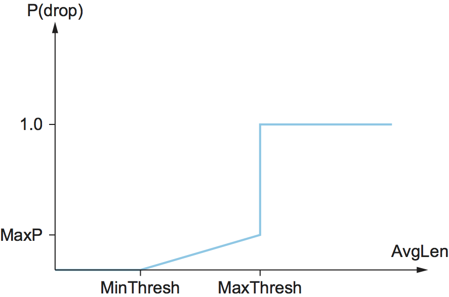

# {{Paj.Toe}}

理解TCP的策略是一旦发生拥塞就控制它,而不是一开始就试图避免拥塞,这一点很重要. 事实上,TCP反复增加对网络的负载,试图找到发生拥塞的点,然后从这一点退缩. 另一种方式,TCP*需要*创建损失以找到连接的可用带宽. 一个吸引人的替代方案,但尚未被广泛采用,是预测何时将发生拥塞,然后降低主机在分组开始丢弃之前发送数据的速率. 我们称之为战略*拥塞避免*把它区别开来*拥塞控制*.

本节描述了三种不同的拥塞避免机制. 前两种方法类似: 它们向路由器中添加少量附加功能,以帮助终端节点预测拥塞. 第三个机制与前两个有很大的不同: 它试图避免纯粹来自端节点的拥塞. 

## 十进制

第一个机制被开发用于数字网络体系结构 (DNA) ,一个具有面向连接的传输协议的无连接网络. 因此,该机制也可以应用于TCP和IP. 如上所述,这里的想法是更均匀地划分路由器和端节点之间的拥塞控制的责任. 每个路由器监视它正在经历的负载,并在拥塞即将发生时明确通知终端节点. 此通知是通过在路由器中设置的数据包中设置二进制拥塞位来实现的,因此*十进制*. 目标主机然后将这个拥塞位复制到它发送回源的ACK. 最后,源调整其发送速率以避免拥塞. 下面的讨论更详细地描述了算法,从路由器中发生的事情开始. 

将单个拥塞比特添加到分组报头中. 路由器在分组到达时其平均队列长度大于或等于1时将该比特设置在分组中. 这个平均队列长度是在跨越最后繁忙+空闲周期的时间间隔上加上当前繁忙周期来测量的.  (路由器是*忙碌的*当它发射时*虚度*当它不是的时候) [图1](#decbit)在路由器上显示队列长度作为时间的函数. 基本上,路由器计算曲线下的区域,并将该值除以时间间隔,以计算平均队列长度. 使用队列长度1作为设置拥塞位的触发器,是在显著排队 (因此具有较高的吞吐量) 和增加的空闲时间 (因此具有较低的延迟) 之间的权衡. 换句话说,1的队列长度似乎优化了幂函数. 

<figure class="line">
	<a id="decbit"></a>
	
	<figcaption>Computing average queue length at a router.</figcaption>
</figure>

现在,让我们把注意力转向机制的主机部分,源记录有多少分组导致某个路由器设置拥塞位. 特别地,源维护一个拥塞窗口,就像TCP中一样,并观察上一个窗口的数据包值中哪一部分导致比特被设置. 如果小于50%的包具有位集,则源增加其拥塞窗口一个分组. 如果上一个窗口的数据包的50%或更多设置了拥塞比特,那么源将其拥塞窗口减小到前一个值的0.875倍. 值50%被选择作为基于分析的阈值,显示它对应于功率曲线的峰值. 之所以选择"增加1,减少0.875"规则,是因为加性增加/乘性减少使机制稳定. 

## 随机早期检测 (RED) 

第二种机制,叫做*随机早期检测*(RED)与DECbit方案类似,因为每个路由器被编程来监控其自身的队列长度,并且当它检测到拥塞即将到来时,通知源来调整其拥塞窗口. 红色是Sally Floyd和雅各布森在20世纪90年代初发明的,它与两种主要方式不同. 

第一种情况是,RED通常实现为*隐含地*通过丢弃其中一个数据包来通知拥塞源. 因此,源被后续超时或重复ACK有效地通知. 如果您还没有猜到,RED被设计为与TCP结合使用,TCP当前通过超时来检测拥塞 (或者检测分组丢失的一些其他方法,例如重复的ACK) . 正如RED首字母缩略词的"."部分所暗示的,网关比它必须更早地丢弃数据包,以便通知消息源它应该比正常情况下更快地减少其拥塞窗口. 换言之,路由器在完全耗尽其缓冲空间之前丢弃几个分组,以便使源减速,希望这意味着以后它不必丢弃大量分组. 请注意,RED可以很容易地适应简单的反馈方案. *标记*一个数据包而不是*滴水*如在侧栏中讨论的显式拥塞通知. 

RED和DECbit之间的第二个区别在于RED如何决定何时丢弃一个分组以及它决定丢弃哪个分组的细节. 为了理解基本思想,考虑一个简单的FIFO队列. 与其等待队列变得完全满,然后被迫丢弃每个到达的数据包 (前一节的尾部丢弃策略) ,我们可以决定丢弃每个到达的数据包*跌落概率*每当队列长度超过某个*跌落高度*. 这个想法叫做*早期随机丢弃*. RED算法定义了如何监视队列长度以及何时丢弃分组的细节. 

在下面的段落中,我们描述了弗洛依德和雅各布森最初提出的RED算法. 我们注意到,此后发明者和其他研究人员都提出了若干修改;其中一些修改在ㄪ进一步阅读ㄫ中进行了讨论. 然而,关键思想与下面给出的相同,并且大多数当前实现都与下面的算法非常接近. 

首先,RED使用与原始TCP超时计算中使用的加权运行平均值来计算平均队列长度. 也就是说,`AvgLen`计算为

```pseudo
AvgLen = (1 - Weight) x AvgLen + Weight x SampleLen
```

0岁以下`Weight`\< 1和`SampleLen`当样本测量时,队列的长度. 在大多数软件实现中,每当一个新的分组到达网关时,就测量队列长度. 在硬件中,它可以在一定的采样间隔下计算. 

使用平均队列长度而不是瞬时队列长度的原因是它更准确地捕获了拥塞的概念. 由于互联网流量的突发性,队列可以很快变得满,然后再次变空. 如果队列大部分时间是空的,那么可能就不应该得出路由器拥塞的结论,并告诉主机减速. 因此,加权运行平均计算试图检测长时间的拥塞,如右侧部分所示. [图2](#red-avg)通过过滤队列长度的短期变化. 你可以把运行平均值看作一个低通滤波器,在那里`Weight`确定过滤器的时间常数. 我们如何选择这个时间常数的问题在下面讨论. 

<figure class="line">
	<a id="red-avg"></a>
	
	<figcaption>Weighted running average queue length.</figcaption>
</figure>
 
Second, RED has two queue length thresholds that trigger certain
activity: `MinThreshold` and `MaxThreshold`. When a packet arrives
at the gateway, RED compares the current `AvgLen` with these two
thresholds, according to the following rules:

```pseudo
if AvgLen <= MinThreshold
    queue the packet
if MinThreshold < AvgLen < MaxThreshold
    calculate probability P
    drop the arriving packet with probability P
if MaxThreshold <= AvgLen
    drop the arriving packet
```

如果平均队列长度小于下阈值,则不采取任何操作,如果平均队列长度大于上阈值,则总是丢弃分组. 如果平均队列长度在两个阈值之间,则以某种概率丢弃新到达的分组. `P`. 这种情况被描述为[图3](#red). 近似关系`P`和`AvgLen`显示在[图4](#red-prob). 注意,下降的概率随时间增长缓慢. `AvgLen`在两个阈值之间,达到`MaxP`在上阈值处,它跳到单位. 这背后的理由是,如果`AvgLen`达到上限,然后温和的方法 (丢弃几个包) 不起作用,需要采取严厉的措施: 丢弃所有到达的分组. 一些研究已经表明,从随机滴落到完全滴落的更平滑的过渡,而不是这里所示的不连续方法,可能是合适的. 

<figure class="line">
	<a id="red"></a>
	
	<figcaption>RED thresholds on a FIFO queue.</figcaption>
</figure>

<figure class="line">
	<a id="red-prob"></a>
	
	<figcaption>Drop probability function for RED.</figcaption>
</figure>
 
Although [Figure 4](#red-prob) shows the probability of drop as a
function only of `AvgLen`, the situation is actually a little more
complicated. In fact, `P` is a function of both `AvgLen` and how
long it has been since the last packet was dropped. Specifically, it is
computed as follows:

```pseudo
TempP = MaxP x (AvgLen - MinThreshold) / (MaxThreshold - MinThreshold)
P = TempP/(1 - count x TempP)
```

`TempP`是在y轴上绘制的变量. [图4](#red-prob),`count`跟踪有多少新到达的数据包已排队 (未丢弃) ,以及`AvgLen`一直在两个阈值之间. `P`缓慢增加`count`增加,从而使下降的可能性越来越大,因为最后一滴下降的时间增加. 这使得紧密间隔的液滴比宽间隔的液滴更不可能发生. 计算中的额外步骤`P`RED的发明人介绍说,如果没有它,包滴在时间上不能很好地分布,而是倾向于以簇的形式出现. 因为来自某个连接的分组到达可能以突发方式到达,所以这种丢包集群可能导致单个连接中的多个丢包. 这是不可取的,因为每往返时间仅一滴就足以导致连接减小其窗口大小,而多滴可能将其送回慢启动. 

作为一个例子,假设我们设置`MaxP`到0.02和`count`初始化为零. 如果平均队列长度是两个阈值之间的一半,那么`TempP`和初始值`P`将是一半`MaxP`或0.01. 一个到达的包,当然,在这一点上有99的100的机会进入队列. 每一个不丢弃的连续数据包,`P`慢慢地增加,50秒包到达的时间没有下降,`P`将加倍到0.02. 在不可能发生的情况下,99包没有丢失,`P`达到1,保证下一个分组被丢弃. 该算法的这一部分的重要之处在于,它确保了随时间的大致均匀的液滴分布. 

目的是,如果红色的数据包的百分比很小`AvgLen`超过`MinThreshold`这将导致一些TCP连接减小其窗口大小,从而将降低分组到达路由器的速率. 一切顺利,`AvgLen`然后将减少和拥塞避免. 队列长度可以保持短,而吞吐量保持高,因为很少的数据包被丢弃. 

请注意,因为RED对随时间平均的队列长度进行操作,所以瞬时队列长度可能远大于`AvgLen`. 在这种情况下,如果一个数据包到达并且没有地方放它,那么它必须被丢弃. 当这种情况发生时,Red在尾流模式下运行. 红色的目标之一是防止可能出现的甩尾行为. 

红色的随机性质赋予了算法一个有趣的性质. 因为RED随机丢弃分组,所以RED决定丢弃特定流的分组的概率与该流当前在该路由器处获得的带宽份额大致成比例. 这是因为发送相对大量的数据包的流为随机丢弃提供更多的候选. 因此,在红色中建立公平资源分配是有意义的,尽管它绝不是精确的. 

注意,例如,在设置各种红色参数时,已经进行了大量的分析. `Weight`-所有的名称优化功率函数 (吞吐量延迟比) . 通过仿真验证了这些参数的性能,表明该算法对它们不敏感. 然而,重要的是要记住,所有这些分析和仿真都取决于网络工作负载的特定特征. Red的实际贡献是路由器能够更精确地管理其队列长度的机制. 精确地定义什么构成最佳队列长度取决于流量混合,并且仍然是一个研究课题,现在从Internet中RED的操作部署中收集真实的信息. 

考虑两个阈值的设置,`MinThreshold`和`MaxThreshold`. 如果交通相当拥挤,那么`MinThreshold`应该足够大以允许链路利用率保持在可接受的高水平. 而且,两个阈值之间的差值应该大于一个RTT中计算的平均队列长度的典型增加. 设置`MaxThreshold`两次`MinThreshold`考虑到今天互联网上的流量组合,这似乎是一个合理的经验法则. 此外,由于我们期望平均队列长度在高负载期间徘徊在两个阈值之间,因此应该有足够的空闲缓冲空间*在上面*
`MaxThreshold`吸收互联网业务中出现的自然突发,而不强制路由器进入尾流模式. 

我们注意到`Weight`确定运行的平均低通滤波器的时间常数,这给了我们一个线索,关于我们如何可以为它选择合适的值. 回想一下,Red试图通过在拥塞期间丢弃分组来向TCP流发送信号. 假设路由器从某个TCP连接丢弃一个分组,然后立即从同一个连接转发更多的分组. 当这些数据包到达接收方时,它开始向发送方发送重复的ACK. 当发送者看到足够的重复ACKs,它将减少其窗口大小. 因此,从路由器丢弃分组的时间直到同一路由器开始看到从受影响的连接中以减小的窗口大小减轻一些负担的时间,该连接必须经过至少一个往返时间. 让路由器在比通过它的连接的往返时间小得多的时间尺度上响应拥塞可能没有多大意义. 如前所述,100毫微秒并不是互联网中平均往返时间的坏估计. 因此,`Weight`应该选择这样的队列长度随时间尺度的变化远远小于100μms被过滤掉. 

由于RED通过向TCP流发送信号来告诉他们减速来工作,所以您可能想知道如果忽略这些信号会发生什么. 这通常被称为*无响应流*问题,这几年来一直是一个值得关注的问题. 与TCP拥塞控制前几天一样,无响应流使用超过其公平份额的网络资源,并且如果它们足够多,则可能导致拥塞崩溃. 下一节中描述的一些技术可以通过将某些类别的流量与其他类别的流量隔离来帮助解决这个问题. 还有一种可能性是,RED的一个变体可能从对它发送的初始提示无响应的流中更严重地下降;这仍然是一个活跃的研究领域. 

## 基于源的拥塞避免

与以前的两个依赖于路由器中新机制的拥塞避免方案不同,我们现在描述一种策略,用于检测终端主机在丢失发生之前的拥塞初始阶段. 我们首先简要概述使用不同信息检测早期拥塞的相关机制的集合,然后详细描述特定机制. 

这些技术的总体思想是监视来自网络的一些信号,表明一些路由器的队列正在建立,如果不采取任何措施,拥塞将很快发生. 例如,源可能注意到,随着网络路由器中分组队列的增加,它发送的每个连续分组的RTT都有可测量的增加. 一种特殊的算法利用这种观察如下: 拥塞窗口通常像TCP中一样增加,但是每隔两次往返延迟,算法就会检查当前的RTT是否大于到目前为止看到的最小和最大RTT的平均值. 如果是,则该算法将拥塞窗口减少八分之一. 

第二个算法做类似的事情. 关于是否改变当前窗口大小的决定是基于RTT和窗口大小的改变. 根据产品的每两个往返延迟调整窗口一次. 

```pseudo
(CurrentWindow - OldWindow) x (CurrentRTT - OldRTT)
```

如果结果是正的,则源将窗口大小减小八分之一;如果结果是负或0,则源将窗口增大一个最大分组大小. 注意,窗口在每次调整期间都会发生变化,也就是说,它在其最佳点附近振荡. 

当网络接近拥塞时,另一个变化是发送速率的扁平化. 第三方案充分利用了这一事实. 每个RTT,它将窗口大小增加一个分组,并将获得的吞吐量与窗口小于一个分组时的吞吐量进行比较. 如果差值小于仅传输一个分组时所达到的吞吐量的一半,如连接开始时的情况,则该算法将窗口减少一个分组. 该方案通过将网络中突出的字节数除以RTT来计算吞吐量. 

第四种机制,我们将更详细地描述,与上一种算法类似,因为它关注吞吐率的变化,或者更具体地说,关注发送速率的变化. 然而,它与第三种算法的不同之处在于它计算吞吐量的方式,并且它不寻找吞吐量的斜率的变化,而是将测量的吞吐量速率与预期的吞吐量速率进行比较. TCP Vigas算法在互联网上没有得到广泛的应用,但其策略仍在继续研究. 

Vegas算法背后的直觉可以在给定的标准TCP跟踪中看到. [图5](#trace3). 图中显示的顶部图[图5](#trace3)跟踪连接的拥塞窗口;它显示与本节前面给出的跟踪相同的信息. 中间图和底部图描述了新的信息: 中间图显示了在源处测量的平均发送速率,底部图显示了在瓶颈路由器处测量的平均队列长度. 所有这三个图在时间上是同步的. 在4.5和6秒 (阴影区域) 期间,拥塞窗口增加 (上图) . 我们预期观察到的吞吐量也会增加,但它保持平坦 (中间图) . 这是因为吞吐量不能超过可用带宽. 除此之外,窗口大小的任何增加只会导致数据包占用瓶颈路由器 (底部图) 的缓冲空间. 

<figure class="line">
	<a id="trace3"></a>
	
	<figcaption>Congestion window versus observed throughput rate (the
	three graphs are synchronized). Top, congestion window; middle,
	observed throughput; bottom, buffer space taken up at the
	router. Colored line = `CongestionWindow`; solid bullet = timeout;
	hash marks = time when each packet is transmitted; vertical bars =
	time when a packet that was eventually retransmitted was first
	transmitted.</figcaption>
</figure>

一个有用的隐喻来描述这种现象. [图5](#trace3)在冰上行驶. 速度计 (拥堵窗口) 可能说你一小时行驶30英里,但是通过向车窗外看,看到人们步行经过 (测量发送速率) ,你就知道你一小时行驶不超过5英里. 额外的能量正在被汽车轮胎 (路由器缓冲器) 吸收. 

TCP Vegas使用这种思想来测量和控制该连接在传输中的额外数据量,其中"额外数据"指的是源在试图精确匹配网络的可用带宽时不会发送的数据. TCP Vigas的目标是在网络中维护"正确"的额外数据量. 显然,如果一个源发送太多的额外数据,它将导致长的延迟,并且可能导致拥塞. 不太明显,如果一个连接发送的额外数据太少,它就不能对可用网络带宽的瞬时增加作出足够快的响应. TCP Vegas的拥塞避免动作基于网络中估计额外数据量的变化,而不仅仅基于丢弃的分组. 我们现在详细描述算法. 

首先,定义一个给定的流`BaseRTT`当流量不拥挤时成为数据包的RTT. 在实践中,TCP Vigas集`BaseRTT`至所有测量的往返时间的最小值;它通常是由连接发送的第一个分组的RTT,在路由器队列由于该流生成的流量而增加之前. 如果假设我们没有溢出连接,则预期吞吐量由

```pseudo
ExpectedRate = CongestionWindow / BaseRTT
```

哪里`CongestionWindow`是TCP拥塞窗口,我们假设 (为了这个讨论的目的) 等于传输中的字节数. 

其次,TCP Vigas计算当前发送速率,`ActualRate`. 这是通过记录区分分组的发送时间ㄡ记录在发送分组的时间与接收到其确认的时间之间发送了多少字节ㄡ当其确认到达时计算区分分组的样本RTT以及划分麻木来完成的. 采样RTT发送的字节数. 这个计算是每回程一次. 

第三,TCP维加斯比较`ActualRate`到`ExpectedRate`并相应地调整窗口. 我们让`Diff = ExpectedRate -
ActualRate`. 注意`Diff`定义为正或0,因为`ActualRate >ExpectedRate`意味着我们需要改变`BaseRTT`到最新采样RTT. 我们还定义了两个阈值$alpha\<beta$$,大致分别对应于网络中的额外数据太少和太多. 什么时候?`Diff`\<$$ Alpha $,TCP Vigas在下一个RTT期间线性增加拥塞窗口,以及何时`Diff`$$beta $ $,TCP Vigas在下一个RTT期间线性地减少拥塞窗口. TCP Vegas保持拥塞窗口不变时,$$alpha $ $\<`Diff`\< $ $beta $$. 

直观地,我们可以看到,实际吞吐量离预期吞吐量越远,网络中的拥塞就越多,这意味着应该降低发送速率. $$beta $ $门槛触发这种下降. 另一方面,当实际吞吐率太接近预期吞吐量时,连接存在未利用可用带宽的危险. $$阿尔法$门槛触发这一增长. 总体目标是在网络中保持$$alpha和$beta $ $$额外字节. 

<figure class="line">
	<a id="vegas"></a>
	
	<figcaption>Trace of TCP Vegas congestion-avoidance mechanism.
	Top, congestion window; bottom, expected (colored line) and actual
	(black line) throughput. The shaded area is the region between the
	$$\alpha$$ and $$beta$$ thresholds.</figcaption>
</figure>

[图6](#vegas)跟踪TCP Vigas拥塞避免算法. 顶部图跟踪拥塞窗口,显示与本章中给出的其他跟踪相同的信息. 底部图跟踪管理拥塞窗口设置的预期吞吐量和实际吞吐率. 正是这个底部图最能说明算法是如何工作的. 彩色线跟踪`ExpectedRate`而黑线跟踪`ActualRate`. 宽阴影条带给出$alpha$$和$beta$$阈值之间的区域;阴影条带的顶部远离$alpha$$KBps. `ExpectedRate`,阴影带的底部是$$beta $$kbps远离`ExpectedRate`. 目标是保持`ActualRate`在这两个阈值之间,在阴影区域内. 无论何时`ActualRate`落在阴影区域下面 (也就是说,离得太远) `ExpectedRate`TCP Vigas减少了拥塞窗口,因为它担心太多的数据包被缓存在网络中. 同样,无论何时`ActualRate`超过阴影区域 (即,变得太靠近) . `ExpectedRate`) ,TCP Vigas增加了拥塞窗口,因为它担心它正在充分利用网络. 

因为正如刚才介绍的,该算法将实际和预期吞吐率之间的差异与$alpha$$和$beta$$阈值进行比较,所以这两个阈值是根据KBps定义的. 然而,从多少额外的角度考虑也许更准确. *缓冲器*该连接在网络中占据. 例如,在与`BaseRTT`如果$alpha$$=30KBps和$beta$$=60KBps,那么我们可以认为$alpha$$指定连接需要占用网络中的至少3个额外缓冲区,而$beta$$指定连接应该占用不超过6个外部缓冲区. 网络中的缓冲区. 在实践中,$ $ alpha $ $ 1缓冲区和$ \\β$ $到3缓冲区的设置工作良好. 

最后,您将注意到,TCP Vegas线性地减少了拥塞窗口,这似乎与确保稳定性需要乘法减少的规则相冲突. 解释是TCP Vigas在超时发生时使用乘法减少;刚才描述的线性减少是*早期的*拥塞发生前拥塞发生的减少,分组开始丢失. 
