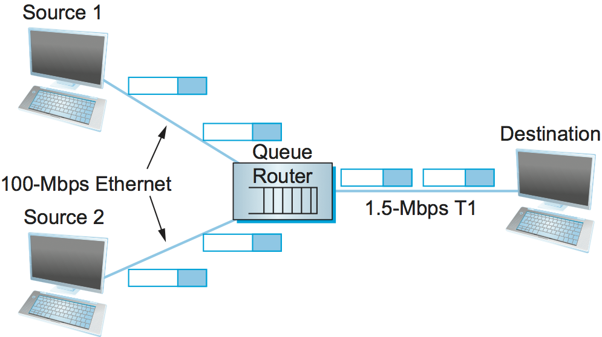

# {{Paj.Toe}}

资源分配和拥塞控制是自第一代网络设计以来一直备受关注的复杂问题. 他们仍然是活跃的研究领域. 使这些问题复杂的一个因素是它们不是孤立于协议层次的一个单一层次. 资源分配部分在网络内的路由器ㄡ交换机和链路中实现,部分在终端主机上运行的传输协议中实现. 终端系统可以使用信令协议将其资源需求传达给网络节点,网络节点用关于资源可用性的信息作出响应. 本章的主要目标之一是定义一个可以理解这些机制的框架,以及给出有关机制的代表性示例的相关细节. 

在进一步研究之前,我们应该澄清我们的术语. 通过*资源分配*我们指的是网络元素试图满足应用程序对网络资源的竞争需求的过程,主要是路由器或交换机中的链路带宽和缓冲空间. 当然,通常不可能满足所有的需求,这意味着一些用户或应用程序可能收到比他们想要的更少的网络资源. 资源分配问题的一部分是决定何时拒绝和对谁. 

我们使用这个词*拥塞控制*描述网络节点为防止或响应过载条件所做的努力. 因为拥挤通常对每个人都有害,所以第一要务是让拥挤得到缓解,或者首先防止拥挤. 这可以通过说服少数主机停止发送来实现,从而改善其他人的情况. 然而,拥塞控制机制更常见的是具有一些公平性的方面,即,它们试图在所有用户之间共享痛苦,而不是给少数用户造成巨大的痛苦. 因此,我们看到许多拥塞控制机制都有某种资源分配. 

理解流量控制和拥塞控制之间的差异也是很重要的. 流量控制包括保持一个快速发送器超越一个缓慢的接收器. 相比之下,拥塞控制旨在使发送者不发送太多的数据. *进入网络*因为在某种程度上缺乏资源. 这两个概念经常被混淆,正如我们将看到的,它们也有一些机制. 

## 网络模型

我们首先定义网络架构的三个显著特征. 在大多数情况下,这是前面章节介绍的有关资源分配问题的材料的总结. 

### 分组交换网络

我们考虑由多个链路和交换机 (或路由器) 组成的分组交换网络 (或因特网) 中的资源分配. 由于本章中描述的大多数机制都是为在Internet上使用而设计的,因此最初定义为路由器而不是交换机,所以我们使用*路由器*贯穿我们的讨论. 无论是在网络上还是在互联网络上,问题都是相同的. 

在这样的环境中,给定源在直接传出链路上可能具有足够的容量来发送分组,但是在网络中心的某个地方,其分组遇到许多不同的业务源正在使用的链路. [图1](#congestion)说明这种情况下,两个高速链路正在馈送低速链路. 这与以太网和无线网络等共享接入网络形成对比,其中源可以直接观察网络上的流量并相应地决定是否发送分组. 我们已经看到了用于在共享接入网络 (例如以太网和Wi-Fi) 上分配带宽的算法. 这些访问控制算法在某种意义上类似于交换网络中的拥塞控制算法. 

注意拥塞控制是一个不同于路由的问题. 虽然拥塞链路的确可以通过路由协议分配较大的边缘权重,并且结果,路由器将围绕它进行路由,"围绕"拥塞链路通常不能解决拥塞问题. 要看到这一点,我们不需要再看一看简单的网络. [图1](#congestion),所有的流量都必须通过同一路由器到达目的地. 虽然这是一个极端的例子,但是有一个路由器是不可能绕过的. 这个路由器会变得拥挤,路由机制对此无能为力. 这个拥塞的路由器有时被称为*瓶颈*路由器. 

### 无连接流

在讨论过程中,我们假设网络本质上是无连接的,任何面向连接的服务都是在终端主机上运行的传输协议中实现的.  (我们马上"基本上"解释了) 这正是Internet的模型,其中IP提供无连接数据报传递服务,TCP实现端到端连接抽象. 请注意,这种假设不适用于ATM和X.25等虚拟电路网络. 在这样的网络中,当建立电路时,连接建立消息遍历网络. 该设置消息为每个路由器的连接保留一组缓冲区,从而提供拥塞控制的形式ℴℴ只有在每个路由器上能够分配足够的缓冲区时才建立连接. 这种方法的主要缺点是,它导致为特定电路保留的资源缓冲区未得到充分利用,即使其它业务当前未被该电路使用,这些资源缓冲区也不能被其他业务使用. 本章的重点是在互联网中应用的资源分配方法,因此我们主要关注无连接网络. 

<figure class="line">
	<a id="congestion"></a>
	
	<figcaption>A potential bottleneck router.</figcaption>
</figure>

我们需要获得这个条件的资格. *无连接的*因为我们将网络分类为无连接或面向连接的有点太限制了;在它们之间有一个灰色区域. 特别地,假设所有数据报在无连接网络中完全独立是太强的. 数据报当然是独立交换的,但是通常情况下,特定主机对之间的数据报流会流经特定路由器集. A的想法*流*-在源/目的地对之间发送并通过网络遵循相同路由的数据包序列-在资源分配上下文中是一个重要的抽象;这是我们在本章中使用的一个. 

流抽象的一个力量是流动可以定义在不同的粒度上. 例如,流可以是主机到主机 (即,具有相同的源/目的地主机地址) 或进程到进程 (即,具有相同的源/目的地主机/端口对) . 在后一种情况下,一个流基本上与一个通道相同,就像我们在这本书中一直使用这个术语一样. 我们引入新术语的原因是,流对于网络中的路由器是可见的,而通道是端到端的抽象. [图2](#flow)说明通过一系列路由器的若干流. 

<figure class="line">
	<a id="flow"></a>
	
	<figcaption>Multiple flows passing through a set of routers.</figcaption>
</figure>

因为多个相关的分组流经每个路由器,所以有时为每个流维护一些状态信息是有意义的,这些信息可以用于对属于该流的分组进行资源分配决策. 这种状态有时被称为*软态*软状态和硬状态的主要区别在于,软状态不必总是通过信令显式创建和移除. 软状态代表了一个纯粹的无连接网络之间的中间点. *不*在路由器上的状态和在路由器上保持硬状态的纯面向连接的网络. 通常,网络的正确操作不依赖于存在的软状态 (每个分组仍然正确地路由而不考虑该状态) ,但是当分组恰好属于路由器当前保持软状态的流时,则路由器能够更好地保持T状态. 处理数据包. 

注意,流可以隐式定义或显式地建立. 在前一种情况下,每个路由器监视发生在相同源/目的对之间的分组. 路由器通过检查报头中的地址来执行此操作,并将这些分组作为拥塞控制目的而属于同一个流. 在后一种情况下,源通过网络发送流设置消息,声明包的流即将开始. 虽然显式流与跨面向连接的网络的连接毫无争议,但我们注意到这种情况,因为即使在明确地建立时,流也不意味着任何端到端语义,特别地,并不意味着V的可靠和有序递送. 虚拟电路它只是为了资源分配的目的而存在的. 在本章中,我们将看到隐式和显式流的例子. 

### 服务模型

在本章的早期部分,我们将着重于假设互联网的尽力而为服务模式的机制. 通过尽力而为的服务,所有的包被给予基本上相等的处理,终端主机没有机会向网络询问某些包或流被给予某些保证或优惠服务. 定义支持某种首选服务或保证的服务模型 (例如,保证视频流所需的带宽) 是后面章节的主题. 据说这样的服务模型可以提供多个服务模式. *服务质量* (QoS) 正如我们将看到的,实际上存在各种可能性,从纯粹尽力的服务模型到单个流接收QoS的定量保证的服务模型. 最大的挑战之一是定义一个服务模型,该模型能够满足各种应用程序的需求,甚至允许将来要发明的应用程序. 

## 分类学

资源分配机制有无数种不同的方式,因此创建彻底的分类法是一个困难的命题. 现在,我们描述资源分配机制可以沿着的三个维度进行表征;在本章中,将给出更微妙的区别. 

### 以路由器为中心与主机为中心{{秒}: 正中}

资源分配机制可以分为两大类: 那些从网络内部 (即,在路由器或交换机处) 解决问题的机制和那些从网络边缘 (即,在主机中,也许在传输协议内) 解决问题的机制. 由于网络内部的路由器和网络边缘的主机都参与资源分配,所以真正的问题是负担的大部分落在哪里. 

在以路由器为中心的设计中,每个路由器负责决定何时转发分组和选择丢弃哪些分组,以及通知正在生成网络流量的主机允许它们发送多少分组. 在以主机为中心的设计中,终端主机观察网络条件 (例如,它们正成功地通过网络获得多少数据包) ,并相应地调整它们的行为. 请注意,这两组不是互斥的. 例如,将管理拥塞的主要负担放在路由器上的网络仍然期望终端主机遵守路由器发送的任何咨询消息,而使用端到端拥塞控制的网络中的路由器仍然有一些用于决定w的策略,不管多么简单当它们的队列溢出时,它们会被丢弃. 

### 基于预约与反馈的关系

资源分配机制有时被分类的第二种方式是根据它们是否使用. *预订*或*反馈*. 在基于预约的系统中,一些实体 (例如,终端主机) 请求网络为流分配一定量的容量. 然后,每个路由器分配足够的资源 (缓冲器和/或链路带宽的百分比) 来满足这个请求. 如果在某些路由器上不能满足请求,因为这样做会超出其资源,则路由器拒绝保留. 这类似于拨打电话时占线信号. 在基于反馈的方法中,终端主机在不保留任何容量的情况下开始发送数据,然后根据接收到的反馈调整它们的发送速率. 这个反馈可以是*明确的* (即拥塞的路由器发送一个"请慢下来"消息到主机) 或*隐性的* (即,终端主机根据网络的外部可观测行为,例如分组丢失来调整其发送速率) . 

注意,基于预订的系统总是意味着以路由器为中心的资源分配机制. 这是因为每个路由器负责跟踪其当前可用容量的多少,并决定是否可以接纳新的预订. 路由器还必须确保每个主机都在它所预订的地方. 如果主机发送数据的速度比它预订时声称的更快,那么如果路由器变得拥挤,那么该主机的数据包是丢弃的好候选. 另一方面,基于反馈的系统可以暗示路由器或主机为中心的机制. 通常,如果反馈是显式的,那么在资源分配方案中,至少在一定程度上涉及路由器. 如果反馈是隐式的,那么几乎所有的负担都落到终端主机上;当数据包变得拥塞时,路由器会默默地丢弃它们. 

预订不必由终端主机来完成. 网络管理员可以将资源分配给流或者更大的流量集合,我们将在后面的小节中看到. 

### 基于窗口与速率的关系

描述资源分配机制的第三种方法是根据它们是否是*基于窗口*或*基于速率*. 这是上面提到的领域之一,其中类似的机制和术语用于流量控制和拥塞控制. 流控制和资源分配机制都需要一种向发送方表达允许发送多少数据的方法. 有两种通用的方法: 用*窗口*或与*率*. 我们已经看到了基于窗口的传输协议,例如TCP,其中接收者向发送者通告窗口. 这个窗口与接收器有多少缓冲空间相对应,并且它限制了发送器可以发送多少数据;也就是说,它支持流控制. 类似的机制-窗口广告-可以在网络内用于预留缓冲空间 (即,支持资源分配) . TCP拥塞控制机制是基于窗口的. 

还可以使用速率 (即,接收机或网络每秒能够吸收多少比特) 来控制发送者的行为. 基于速率的控制对于许多多媒体应用是有意义的,这些应用倾向于以某种平均速率生成数据,并且需要至少一些最小吞吐量才能有用. 例如,视频编解码器可以以平均速率为1μMbps的视频生成峰值速率为2μMbps的视频. 正如我们将在本章后面看到的,基于速率的流特征化在基于保留的系统中是一个逻辑选择,该系统支持不同的服务质量,发送者为每秒这么多位进行预留,并且沿着路径的每个路由器确定它是否能够支持ra考虑到其他流动,它已经做出了承诺. 

### 资源分配分类综述

正如我们刚才所做的,在三个维度的每个维度上把资源分配方法分成两个不同的点,这似乎提出了多达八个独特的策略. 虽然八种不同的方法当然是可能的,但我们注意到,在实践中,两种通用策略似乎最为普遍;这两种策略与网络的底层服务模型相关联. 

一方面,尽力而为的服务模型通常意味着正在使用反馈,因为这样的模型不允许用户预留网络容量. 反过来,这意味着拥塞控制的大部分责任落在终端主机上,也许是来自路由器的一些帮助. 在实践中,这样的网络使用基于窗口的信息. 这是互联网上采用的一般策略. 

另一方面,基于QoS的服务模型可能意味着某种形式的保留. 对这些保留的支持可能需要显著的路由器参与,例如根据所需的保留资源的级别不同地对分组进行排队. 此外,在速率方面表达这种保留是很自然的,因为Windows只间接地涉及用户从网络需要多少带宽. 我们在后面的章节中讨论这个话题. 

## 评价标准

最后一个问题是知道资源分配机制是否好. 回想一下,在本章开头的问题陈述中,我们提出了一个网络的问题. *有效地*和*相当地*分配资源. 这表明至少两个广泛的措施,可以评估资源分配方案. 我们依次考虑每个问题. 

### 有效资源分配

评估资源分配方案有效性的一个良好起点是考虑两个主要的网络度量: 吞吐量和延迟. 显然,我们需要尽可能多的吞吐量和尽可能少的延迟. 不幸的是,这些目标往往有些矛盾. 资源分配算法增加吞吐量的一个可靠方法是允许尽可能多的分组进入网络,从而将所有链路的利用率提高到100%. 我们这样做是为了避免链路空闲的可能性,因为空闲链路必然会损害吞吐量. 这种策略的问题是增加网络中的分组数量也会增加每个路由器处的队列长度. 较长的队列又意味着网络中的包被延迟的时间更长. 

为了描述这种关系,一些网络设计者提出了使用吞吐量与延迟的比例作为评估资源分配方案有效性的度量. 这个比率有时被称为*权力*网络: 

```pseudo
Power = Throughput / Delay
```

注意,权力是衡量资源配置有效性的正确指标并不明显. 一方面,功率背后的理论基于假定无限队列的M/M/1排队网络;真实网络具有有限的缓冲区,有时不得不丢弃分组. 另一方面,电力通常是相对于单个连接 (流) 定义的;不清楚它是如何扩展到多个相互竞争的连接的. 然而,尽管有相当严重的局限性,但没有其他方法得到广泛的认可,因此仍在使用电力. 

> 由于这不是排队理论书,我们只提供了M/M/1队列的简要描述. 1表示它有一个单一的服务器,Ms表示数据包到达和服务时间的分布都是"马尔可夫分布"或指数分布. 

目标是最大化这个比率,这是你在网络上放置多少负载的函数. 负载又由资源分配机制来设置. [图3](#power)给出一个代表性的功率曲线,在理想情况下,资源分配机制将在该曲线的峰值处运行. 在峰值的左边,该机制太保守了;也就是说,它没有允许发送足够的数据包来保持链路的忙碌. 在峰值的右边,如此多的分组被允许进入网络,由于排队而增加的延迟开始支配任何小的吞吐量增益. 

有趣的是,这个功率曲线看起来非常像分时计算机系统中的系统吞吐量曲线. 系统吞吐量随着更多的作业被允许进入系统而提高,直到它达到运行如此多的作业以至于系统开始颠簸 (花费所有时间交换内存页) 并且吞吐量开始下降的程度. 

<figure class="line">
	<a id="power"></a>
	
	<figcaption>Ratio of throughput to delay as a function of load.</figcaption>
</figure>

正如我们将在本章的后几节中看到的,许多拥塞控制方案只能以非常粗略的方式控制负载;也就是说,简单地将"旋钮"调低一点并且只允许少量的附加分组进入网络是不可能的. 因此,网络设计者需要关注当系统在非常重的负载下运行时会发生什么,即,在[图3](#power). 理想情况下,我们希望避免系统吞吐量达到零的情况,因为系统正在颠簸. 在网络术语中,我们需要一个系统. *稳定的*-即使网络在重载下运行,包继续通过网络. 如果一个机制不稳定,网络可能会经历*拥塞崩溃*.

### 公平资源分配

网络资源的有效利用并不是判断资源分配方案的唯一标准. 我们还必须考虑公平问题. 然而,当我们试图定义什么构成公平的资源分配时,我们很快就进入了黑暗的水域. 例如,基于预约的资源分配方案提供了一种显式的方式来创建受控的不公平性. 利用这种方案,我们可以使用保留来使视频流能够在某个链路上接收1Mbps,而文件传输在同一链路上仅接收10kbps. 

在没有相反的显式信息的情况下,当多个流共享一个特定链路时,我们希望每个流接收相等的带宽份额. 这个定义假定*公平的*带宽的共享意味着*平等的*带宽共享. 但是,即使在没有保留的情况下,同样的股份也不能等同于公平的股份. 我们也应该考虑路径的长度是否被比较?例如,如图所示[图4](#path-len)当14跳流与31跳流竞争时,什么才是公平的?

<figure class="line">
	<a id="path-len"></a>
	
	<figcaption>One four-hop flow competing with three one-hop
	flows.</figcaption>
</figure>

假设公平意味着相等,并且所有路径都具有相同的长度,网络研究人员Raj Jain提出了一个度量,可以用来量化拥塞控制机制的公平性. Jain的公平指数定义如下. 给定一组流量吞吐量

$ (x) *{ 1 },x*{ 2 },\\LDOTS,X{{N}) $$

 (以一致的单位如比特/秒测量) ,以下函数为流分配公平指数: 

$$ (x) *{ 1 },x*{ 2 },\\LDOTS,X*{n}=\\Frace{ (\\) *{i=1 }^ ^ n}x*{i} ^ { 2 } {n\\-和*{i=1 } ^ {n} x{{i}^ ^ 2 } $ $

公平性指数总是导致0和1之间的数目,1表示最大公平性. 要理解此度量背后的直观性,请考虑以下情况: 所有$n$流每秒接收1单位数据的吞吐量. 我们可以看到,在这种情况下的公平性指数是

$ $ \\压裂{n^ 2 }{n\\n n}=1美元$

现在,假设一个流接收到1美元+Delta $ $的吞吐量. 现在的公平指数是

$$ \\ { ( (n 1) +1 +△) ^ 2 } n (n- 1 + (1 +δ) ^ 2) }= \\Frace{n^ 2 +2n\\delta+Δ^ 2 }{n^ 2 +2nDelta +nΔ^ 2 }$$

请注意,分母超过分子$ $ (N-1) \\Δ^ 2 $ $. 因此,无论奇数流出获得的流量是多于还是少于所有其他流 (正的或负的$\\Delta$$) ,公平性指数现在都降到了1以下. 另一个需要考虑的简单情况是$n$流中只有$k$获得相等的吞吐量,而其余$n-k$用户获得零吞吐量,在这种情况下,公平性索引下降到$k/n$. 
