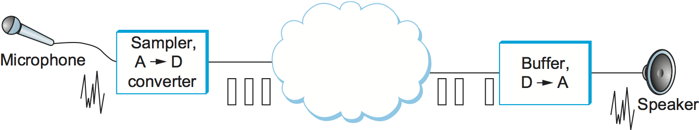
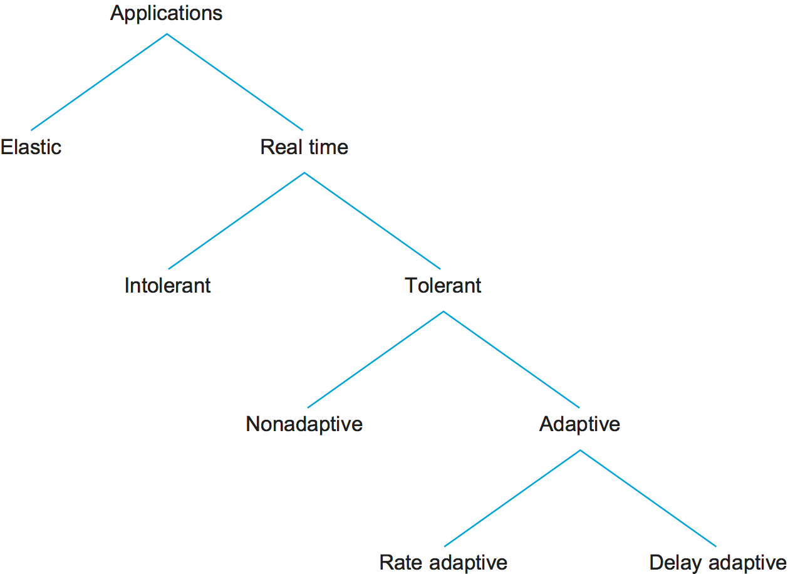
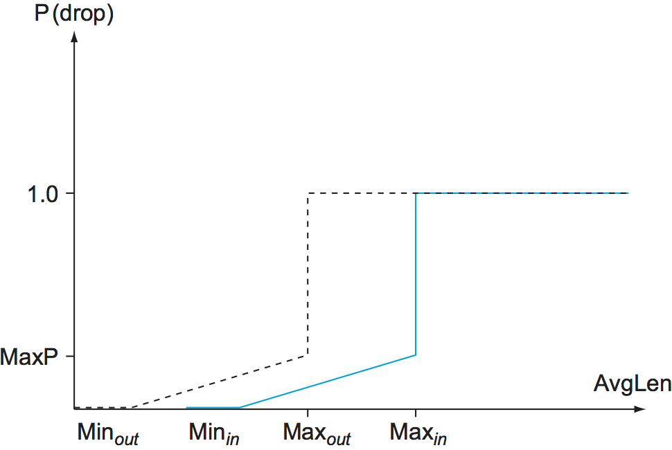

# {{Paj.Toe}}

多年来,分组交换网络已经提供了对组合音频ㄡ视频和数据的多媒体应用的支持. 毕竟,一旦数字化,音频和视频信息就变成了任何其他形式的数据,即要传输的比特流. 实现这一承诺的一个障碍是需要更高带宽的链路. 然而,近来,编码方面的改进降低了音频和视频应用的带宽需求,同时链路速度也提高了. 

然而,在网络上传输音频和视频比仅仅提供足够的带宽更多. 例如,电话交谈的参与者期望能够以这样的方式交谈,即一人能够对另一人说的话作出反应并且几乎立即被听到. 因此,交付的及时性可能是非常重要的. 我们指的是对数据的及时性敏感的应用程序. *实时应用*. 语音和视频应用是典型的例子,但是还有其他的例子,比如工业控制ℴℴ你希望机器人手臂在撞到什么东西之前收到一个命令. 甚至文件传输应用程序也有时间限制,比如要求数据库更新在需要数据的业务第二天恢复之前一夜之间完成. 

实时应用的显著特点是它们需要某种保证. *从网络*这些数据很可能准时到达 (对于时间的某些定义) . 而非实时应用程序可以使用端到端重传策略来确保数据到达. *正确地*这样的策略不能提供及时性: 如果数据到达延迟,重传只会增加总延迟. 及时到达必须由网络本身 (路由器) 提供,而不仅仅是在网络边缘 (主机) . 因此,我们得出结论,网络试图传递您的数据,但是没有做出承诺,而将清理操作留给边缘的最佳努力模型对于实时应用程序是不够的. 我们需要的是一种新的服务模式,其中需要更高保证的应用程序可以向网络请求. 然后,网络可以通过提供它将做得更好的保证,或者也许通过说它目前不能承诺任何更好的东西来作出响应. 请注意,这样的服务模型是当前模型的超集: 对尽力而为的服务满意的应用程序应该能够使用新的服务模型;它们的要求就不那么严格了. 这意味着网络将不同于其他包来对待某些包ℴℴ这是在最佳努力模型中没有做到的. 能够提供这些不同级别的服务的网络通常被称为支持服务质量 (QoS) . 

在这一点上,你可能会想"坚持下去". 互联网是否已经支持实时应用程序?"在这一点上,我们中的大多数人都尝试过某种网络电话应用程序,例如Skype,而且看起来还不错. 之所以这样,部分原因是因为尽力而为的服务往往是相当好的.  (Skype也做了很多聪明的事情来应对互联网中QoS的缺乏. ) 这里的关键词是"经常". *可靠地*足够好的实时应用程序,那么最好的努力,根据定义,没有保证是不够的. 稍后我们将返回QOS真正需要的主题. 

## 应用要求

在研究可用于向应用程序提供服务质量的各种协议和机制之前,我们应该尝试了解这些应用程序的需求. 首先,我们可以将应用程序分为两类: 实时和非实时. 后者有时被称为*传统数据*应用,因为它们传统上是在数据网络上发现的主要应用. 它们包括最流行的应用程序,如telnetㄡFTPㄡ电子邮件ㄡ网页浏览等等. 所有这些应用程序都无法保证数据的及时传递. 这个非实时类应用的另一个术语是*有弹力的*,因为它们能够在延迟增加的情况下优雅地伸展. 请注意,这些应用程序可以受益于较短的长度延迟,但它们不会变得不可用,因为延迟增加. 还要注意,它们的延迟要求从交互式应用程序 (如telnet) 到更异步的应用程序 (如电子邮件) 有所不同,交互式批量传输如FTP位于中间. 

<figure class="line">
	
	
	<figcaption>An audio application.</figcaption>
</figure>

### 实时音频示例

作为实时应用程序的具体示例,考虑类似于[图1](#audio). 通过收集来自麦克风的样本并使用模数转换器 (A/D) 对其进行数字化来生成数据. 数字样本被放置在分组中,这些分组通过网络传输并在另一端接收. 在接收主机上,数据必须是*回放*以适当的速度. 例如,如果语音样本以每125万美元$MU $ S的速率收集,则它们应该以相同的速率回放. 因此,我们可以认为每个样本都有特定的. *回放时间*接收主机需要的时间点. 在语音示例中,每个样本的回放时间比前一个样本晚125个$$MU $s. 如果数据在适当的回放时间之后到达,或者因为网络延迟或者因为数据被丢弃并且随后被重传,那么它基本上是无用的. 它是完全的无价值的后期数据表征实时应用. 在弹性应用程序中,如果数据按时出现可能会很好,但我们仍然可以使用它. 

使语音应用程序工作的一种方式是确保所有样本遍历网络所需的时间完全相同. 然后,由于样品以每125$mu$s1次注射的速率注射,所以它们将以相同的速率出现在接收器上,准备回放. 然而,通常很难保证通过分组交换网络的所有数据将经历完全相同的延迟. 分组在交换机或路由器中遇到队列,并且这些队列的长度随着时间而变化,这意味着延迟趋向于随时间而变化,因此,对于音频流中的每个分组,可能存在差异. 在接收机端处理这个问题的方法是缓冲一些保留的数据,从而总是提供等待在正确时间回放的数据包的存储. 如果一个包被延迟了很短的时间,它进入缓冲区,直到它的播放时间到来. 如果它被延迟了很长时间,那么在回放之前,它不需要存储在接收器的缓冲区中很长的时间. 因此,我们已经有效地添加了作为一种保险形式的所有分组的回放时间的恒定偏移. 我们称之为偏移. *回放点. *我们唯一遇到问题的时候是,如果数据包在网络中延迟了这么长的时间,以至于它们在回放时间之后到达,导致回放缓冲区耗尽. 

回放缓冲区的操作如图所示. [图2](#playback). 左边的对角线显示包以稳定的速率产生. 波浪线显示了数据包何时到达,它们被发送之后的一些可变时间,这取决于它们在网络中遇到的情况. 右边的对角线显示了在放映缓冲区中放置一段时间后,以稳定速率放映的数据包. 只要回放线在时间上足够远,应用程序就不会注意到网络延迟的变化. 然而,如果我们将回放线路稍微向左移动,那么一些数据包将开始太晚而无法使用. 

<figure class="line">
	
	
	<figcaption>A playback buffer.</figcaption>
</figure>

对于我们的音频应用来说,我们能延迟播放数据有多大的限制. 如果你说话和听众听到你讲话之间的时间超过300ms,就很难进行对话. 因此,在这种情况下,我们希望从网络得到的是保证我们所有的数据在300ms内到达. 如果数据提前到达,我们就缓冲它,直到播放正确. K时间. 如果来晚了,我们就没有用处了,必须抛弃它. 

<figure class="line">
	
	
	<figcaption>Example distribution of delays for an Internet
	connection.</figcaption>
</figure>

为了更好地了解网络延迟是如何变化的,[图3](#jitter2)显示在一个特定的日子里在互联网上的某个路径上测量的单向延迟. 虽然确切的数字会根据路径和日期而变化,但这里的关键因素是*易变性*的延迟,这是一贯发现在几乎任何路径在任何时间. 如图顶部给出的累积百分比所示,在这种情况下,97%的分组具有100ms或更少的延迟. 这意味着,如果我们的示例音频应用程序将回放点设置为100ms,那么平均每100个分组中有3个到达得太晚而无法使用. 这张图需要注意的一点是曲线的尾部向右延伸的距离很长. 我们必须将播放点设置在200毫秒以上,以确保所有数据包及时到达. 

### 实时应用的分类

现在,我们已经对实时应用程序如何工作有了具体的概念,我们可以看一些不同类型的应用程序,它们用来激励我们的服务模型. 以下分类法主要归功于ClarkㄡBradenㄡShenker和Zhang的工作,关于这个主题的论文可以在本章的进一步阅读部分找到. 概述了应用程序的分类. [图4](#taxonomy).

<figure class="line">
	
	
	<figcaption>Taxonomy of applications.</figcaption>
</figure>

我们能够对应用程序进行分类的第一个特征是它们对数据丢失的容忍度,其中"丢失"可能发生,因为数据包到达得太晚而不能回放,以及由网络中的常见原因引起的. 一方面,一个丢失的音频样本可以从周围样本中插值,对感知的音频质量影响相对较小. 只有越来越多的样本丢失,质量下降到讲话变得难以理解的程度. 另一方面,机器人控制程序很可能是不能容忍丢失数据包的实时应用程序的示例,其中包含指示机器人手臂停止的命令是不可接受的. 因此,我们可以将实时应用程序分类为*宽容的*或*不能容忍的*取决于他们是否能忍受偶尔的损失. (顺便说一下,请注意,许多实时应用程序比非实时应用程序更容忍偶尔的丢失;例如,将我们的音频应用程序与FTP进行比较,其中未纠正的一位丢失可能使文件完全无用. )

表征实时应用的第二种方式是通过它们的适应性. 例如,音频应用程序可能能够适应数据包在网络中穿越时所经历的延迟量. 如果我们注意到数据包几乎总是在发送后300ms内到达,那么我们可以相应地设置回放点,缓冲任何在300ms内到达的数据包. 如果我们将播放点提升到100μms,那么应用程序的用户可能会感知到改进. 转换回放点的过程实际上需要我们在一段时间内以增加的速率播放样本. 通过语音应用,这可以通过几乎无法察觉的方式来完成,只需缩短单词之间的沉默即可. 因此,在这种情况下,回放点调整是相当容易的,并且它已经被有效地实现为若干语音应用,例如众所周知的音频电话会议程序`vat`. 注意,回放点调整可以在任一方向发生,但是这样做实际上包括在调整期间对回放信号进行失真,并且这种失真的影响将非常取决于最终用户如何使用数据. 

请注意,如果我们假设所有的包都将在100ms内到达,然后发现一些包稍微晚一点到达,则必须丢弃它们,而如果我们在300ms处离开回放点,则不必丢弃它们. 只有当回放点提供可感知的优势时,并且只有当我们有一些证据表明延迟分组的数目会小到可以接受的程度时,才对回放点进行调整. 我们可以这样做,因为观察到最近的历史或由于网络的一些保证. 

我们调用可以调整回放点的应用程序. *时延自适应*应用. 另一类自适应应用是*速率自适应*. 例如,许多视频编码算法可以权衡比特率与质量. 因此,如果我们发现网络可以支持一定的带宽,那么我们可以相应地设置编码参数. 如果以后有更多的带宽可用,我们可以改变参数以提高质量. 

### QoS Support之路

考虑到应用程序需求的丰富空间,我们需要的是满足任何应用程序需求的更丰富的服务模型. 这导致我们不仅使用一个类 (尽力而为) ,而且使用多个类,每个类都可以满足某些应用程序集的需要. 为了达到这个目的,我们现在准备看一些已经开发的方法,以提供一系列的服务质量. 这些可以分为两大类: 

-   *细粒的*为单个应用程序或流提供QoS的方法

-   *粗粒度的*方法,它为大类数据或聚合业务提供QoS. 

在第一类中,我们发现*综合业务*在IETF中开发的QoS体系结构,通常与资源预留协议 (RSVP) 相关联;ATM的QoS方法也属于这一类. 第二类谎言*区分服务*,这可能是编写时最广泛部署的QoS机制. 我们在接下来的两个小节中依次讨论这些问题. 

最后,正如我们在本节开始部分所建议的,向网络添加QoS支持并不一定是支持实时应用程序的整个过程. 最后,我们再次讨论终端主机可以做些什么来更好地支持实时流,这与集成或差异服务等QoS机制的部署范围无关. 

## 综合服务 (RSVP) 

术语*综合业务* (通常称为短信息) 是指IETF在1995至97年间生产的一种工作体. ItServ工作组开发了一些规格*服务类*设计以满足上述一些应用类型的需要. 它还定义了如何使用RSVP来使用这些服务类进行预订. 下面的段落提供了这些规范和用于实现这些规范的机制的概述. 

### 服务类

服务类之一是为不容忍的应用而设计的. 这些应用程序要求数据包永远不会晚点. 网络应该保证任何分组将经历的最大延迟具有一些指定值;然后应用程序可以设置其回放点,使得在其回放时间之后不会有分组到达. 我们假设数据包的提前到达总是可以通过缓冲来处理. 此服务称为*放心*服务. 

除了有保证的服务,IETF还考虑过其他几种服务,但最终决定采用一种服务来满足容忍的ㄡ自适应的应用需求. 该服务称为*控制负荷*这种类型的现有应用程序在负载不高的网络上运行得非常好. 音频应用`vat`例如,当网络延迟变化时,调整其回放点并产生合理的音频质量,只要丢失率保持在10%或更低的顺序. 

受控负载服务的目的是为那些请求服务的应用模拟轻负载网络,即使网络作为一个整体可能实际上是重载的. 这样做的诀窍是使用诸如WFQ之类的排队机制来隔离受控负载业务与其他业务和某种形式的接纳控制,以限制链路上的受控负载业务的总量,使得负载保持合理低. 下面我们将更详细地讨论接纳控制. 

显然,这两个服务类是所有可能提供的类的子集. 事实上,其他服务被指定,但从未作为IETF工作的一部分标准化. 到目前为止,上述两种服务 (以及传统的最佳努力) 已经证明足够灵活,以满足广泛应用的需要. 

### 机构综述

既然我们已经用一些新的服务类来增强我们的尽力而为的服务模型,下一个问题是我们如何实现一个向应用程序提供这些服务的网络. 本节概述了关键机制. 在阅读本节时,请记住,正在描述的机制仍在由Internet设计社区精心设计. 要从讨论中剥离的主要内容是对支持上面概述的服务模型所涉及的各个部分的总体理解. 

首先,对于尽力而为的服务,我们只能告诉网络我们想要数据包去哪里,然后就把它留在那里,而实时服务则包括告诉网络更多关于我们需要的服务类型的信息. 我们可以给它定性的信息,比如"使用受控负载服务"或者定量的信息,比如"我需要最大延迟100ms". 与高带宽应用相比,将需要更少的网络资源. 我们提供给网络的一组信息称为*流量规格*. 这个名称来源于这样的思想,即一组与单个应用程序关联并且共享共同需求的包被称作*流*与我们在前面章节中使用的术语相一致,概述了相关的问题. 

第二,当我们要求网络为我们提供特定的服务时,网络需要决定它是否能够提供这种服务. 例如,如果10个用户要求一个服务,其中每个用户将始终使用2Mbps的链路容量,并且他们都共享具有10Mbps容量的链路,则网络将不得不对其中一些用户说不. 决定何时拒绝的过程叫做*接纳控制*.

第三,我们需要一种机制,通过该机制,网络的用户和网络本身的组件交换信息,例如服务请求ㄡ流程规范以及准入控制决策. 这有时叫做*信令*但是,因为这个词有几个含义,我们把这个过程称为*资源预留*,并且使用资源预留协议来实现. 

最后,当描述流及其要求并做出接纳控制决策时,网络交换机和路由器需要满足流的要求. 满足这些要求的关键部分是管理分组的排队和调度方式,以便在交换机和路由器中传输. 最后一个机制是*分组调度*.

### 流量规格

FuffSPEC有两个可分离的部分: 描述流的流量特性的部分 (称为流) . *业务类别*) 和描述从网络请求的服务的部分 (*RSpec*) RSPEC是服务特定的并且相对容易描述. 例如,对于受控负载服务,RSpec是微不足道的: 应用程序仅请求受控负载服务,而没有附加参数. 通过保证服务,可以指定延迟目标或绑定.  (在IETF的保证服务规范中,您指定的不是延迟,而是另一个可以计算延迟的量) . 

TSPEC有点复杂. 如上面的示例所示,我们需要向网络提供关于流所使用的带宽的足够信息,以允许做出智能准入控制决策. 然而,对于大多数应用来说,带宽不是单一的数字,而是不断变化的东西. 例如,当场景快速变化时,视频应用程序通常比静止时每秒产生更多的比特. 仅仅知道长期平均带宽是不够的,如下面的例子所示. 假设我们有10个流到达单独的输入端口上的开关,所有的流都留在同一个10 Mbps链路上. 假设在适当适当的长间隔下,每个流可以预期不超过1μMbps. 你可能认为这没有问题. 然而,如果这些是可变的比特率应用,例如压缩视频,那么它们偶尔会发送比它们的平均速率更多的信息. 如果足够多的源以高于其平均速率的速率发送,那么数据到达交换机的总速率将大于10Mbps. 这个多余的数据在被发送到链路之前将被排队. 这种情况持续的时间越长,排队的时间就越长. 数据包可能会被删除,即使它不这样,队列中的数据也会被延迟. 如果包被延迟足够长,则将不提供所请求的服务. 

确切地说,我们如何管理队列来控制延迟和避免丢包是我们下面讨论的内容. 然而,请注意,我们需要知道我们的源带宽随时间的变化. 描述源带宽特性的一种方法称为*令牌桶*过滤器. 这样的过滤器由两个参数描述: 令牌率$R $ $,桶深度$ $B$ $. 它的工作原理如下. 为了能够发送一个字节,我必须有一个令牌. 要发送一个长度为$$$$的包,我需要$$$$令牌. 我从没有记号开始,我以每秒$$$的速度累积它们. 我可以积累不超过$$$ $令牌. 这意味着我可以尽可能快地向网络发送高达$B$字节的突发,但是在足够长的时间间隔内,每秒发送不超过$r$字节. 事实证明,当接纳控制算法试图确定它是否能够适应新的服务请求时,这些信息对接纳控制算法非常有帮助. 

<figure class="line">
	
	
	<figcaption>Two flows with equal average rates but different token
	bucket descriptions.</figcaption>
</figure>

[图5](#token)说明如何使用令牌桶来表征流的带宽需求. 为了简单起见,假设每个流可以作为单个字节而不是作为分组发送数据. 流A以1MBps的稳定速率生成数据,因此可以用速率为$r=1$MBps且桶深度为1字节的令牌桶过滤器来描述它. 这意味着它以1兆字节的速率接收令牌,但是它不能存储1多个令牌. 流程B还以长期平均为1MBps的速率发送,但这样做是通过以2秒以0.5MBps发送,然后以2MBps发送1秒. 由于令牌桶速率$ r$在某种意义上是长期平均速率,所以流程B可以由速率为1MBps的令牌桶来描述. 然而,与流A不同,流B需要至少1MB的桶深度$B$,以便它能够存储令牌,同时它以小于1MBps发送,以便在以2MBps发送时使用. 在本示例中的前两秒钟,它以1MBps的速率接收令牌,但是仅以0.5MBps的速率使用它们,因此它可以节省$2乘以$0.5=1MB的令牌,然后它在第三秒钟 (以及第二秒中继续累积的新令牌) 中花费这些令牌来以2MB发送数据. 在第三秒结束时,花费了多余的令牌,它又开始通过再次发送0.5μMbps来保存它们. 

有趣的是,单个流可以用许多不同的令牌桶来描述. 作为一个简单的例子,流程A可以用与流程B相同的令牌桶来描述,其速率为1MBps,桶深度为1MB. 它实际上从不需要累积令牌这一事实并不意味着这种描述是不准确的,但它确实意味着我们未能向网络传达一些有用的信息,即流A在其带宽需求方面实际上是非常一致的. 通常,最好尽可能明确地了解应用程序的带宽需求,以避免网络中资源的过度分配. 

### 接纳控制

接纳控制背后的思想很简单: 当一些新流想要接收特定级别的服务时,接纳控制查看流的TSpec和RSpec,并尝试决定是否可以向该流量量提供所需的服务,给定当前可用的资源,w它导致任何先前承认的流接收到比它请求的服务更差的服务. 如果它可以提供服务,则允许流;如果没有,则是

准入控制非常依赖于所请求服务的类型和路由器中采用的排队规则;我们将在本节后面讨论后一个主题. 对于有保证的服务,您需要有一个好的算法来做出一个明确的"是"/"否"的决定. 如果在每个路由器上使用加权公平队列,则决策相当简单. 对于受控负载服务,决策可能基于启发式,例如"上一次我允许带有这个TSpec的流入这个类,该类的延迟超出了可接受的界限,因此我最好说不"或"我的当前延迟超出了应该能够达到的界限". 顺其自然. 

准入控制不应混淆*警务*. 前者是每流决定承认新的流动与否. 后者是在每个分组的基础上应用的函数,以确保流符合用于进行预订的TSpec. 如果一个流不符合它的TSpecℴℴ例如,因为它每秒发送的字节是它所说的两倍ℴℴ那么它可能干扰提供给其他流的服务,并且必须采取一些纠正措施. 有几种选择,显而易见的是丢掉冒犯的数据包. 然而,另一个选择是检查数据包是否真的干扰其他流的服务. 如果它们不干扰,则可以在用标签标记后继续发送分组,该标签实际上表示"这是一个不符合要求的分组". 如果需要删除任何数据包,请先删除它. 

接纳控制与重要问题密切相关*政策*. 例如,网络管理员可能希望允许公司CEO所作的预订被接受,同时拒绝较低级别的员工所作的预订. 当然,如果请求的资源不可用,CEO的预订请求可能仍然会失败,所以我们看到,在进行准入控制决策时,策略和资源可用性问题都可以得到解决. 政策在网络中的应用是一个在写作时备受关注的领域. 

### 预留协议

虽然面向连接的网络总是需要一些设置协议来建立交换机中必要的虚拟电路状态,但是像因特网这样的无连接网络没有这样的协议. 然而,正如本节所指出的,当我们想要从网络中获得实时服务时,我们需要向网络提供更多的信息. 虽然已经为Internet提出了许多设置协议,但是目前最关注的是RSVP. 它特别有趣,因为它与面向连接的网络的传统信令协议有很大不同. 

RSVP的一个关键假设是它不应该减损我们在当今无连接网络中发现的健壮性. 由于无连接网络几乎不依赖于或者不依赖于存储在网络本身中的状态,所以路由器可能崩溃并重新引导,并且当端到端连接仍然保持时,链路可能上下移动. RSVP试图通过使用*软态*在路由器中. 与面向连接的网络中发现的硬状态相比,软状态不需要在不再需要时显式地删除. 相反,如果没有定期刷新,它会在一些相当短的时间 (例如,一分钟) 之后超时. 稍后我们将了解这有助于鲁棒性. 

RSVP的另一个重要特征是它的目的是支持多播流,就像单播流一样有效. 这并不奇怪,因为许多可以从改进服务质量中受益的第一个应用程序也是多播应用程序-`vat`和`vic`例如. RSVP设计者的见解之一是,大多数多播应用程序具有比发送者更多的接收器,典型的是大量听众和一个演讲者. 此外,接收机可能具有不同的要求. 例如,一个接收器可能希望仅从一个发送器接收数据,而其他接收器可能希望从所有发送器接收数据. 与其让发送方跟踪潜在的大量接收方,不如让接收方跟踪自己的需求. 这暗示了*面向接收者*RSVP采用的方法. 相比之下,面向连接的网络通常将资源预留留给发送方,正如电话呼叫的发起方通常导致电话网络中的资源被分配. 

RSVP的软状态和面向接收者的性质赋予它许多好的特性. 一个这样的特性是,增加或减少提供给接收器的资源分配水平是非常直接的. 由于每个接收器周期性地发送刷新消息以保持软状态就位,所以很容易发送请求新级别资源的新预约. 此外,软状态优雅地处理网络或节点故障的可能性. 在主机崩溃的情况下,由该主机分配给流的资源自然会超时并被释放. 要了解在发生路由器或链路故障的情况下会发生什么,我们需要更仔细地研究一下进行预订的机制. 

首先,考虑一个发送者和一个接收者试图获得它们之间流动的预订的情况. 有两件事需要在接收方进行预订之前发生. 首先,接收方需要知道发送方可能发送什么流量,以便它能够进行适当的保留. 也就是说,它需要知道发送者的TSPEC. 其次,它需要知道数据包将遵循从发送者到接收者的路径,以便它可以在路径上的每个路由器上建立资源预留. 通过发送来自发送方的消息到包含TSPEC的接收方,可以满足这两个要求. 显然,这会使接收器达到TSPEC. 发生的另一件事情是每个路由器在经过时查看这个消息 (称为PATH消息) ,并计算出*反向路径*它将用于将预约从接收器发送回发送方,以便将预约发送到路径上的每个路由器. 首先建立多播树是通过机制,如在另一章中描述的机制来完成的. 

接收到路径消息后,接收方在RESV消息中发送备份备份多播树. 此消息包含发送者的TSpec和描述该接收器的要求的RSPEC. 路径上的每个路由器查看保留请求并尝试分配必要的资源来满足它. 如果可以进行预约,则将RESV请求传递给下一个路由器. 如果不是,则返回请求的接收者的错误消息. 如果一切顺利,则在发送方和接收方之间的每个路由器上都安装正确的保留. 只要接收方想要保留预订,它每30秒发送一次相同的RESV消息. 

现在我们可以看到路由器或链接失败时会发生什么. 路由协议将适应故障,并创建从发送方到接收方的新路径. PATH消息大约每30秒发送一次,如果路由器检测到其转发表中的变化,则可能更快地发送一次,因此新路由稳定之后的第一个消息将通过新路径到达接收器. 接收器的下一个RESV消息将遵循新路径,如果一切顺利,则在新路径上建立新的保留. 同时,不再在路径上的路由器将停止获取RESV消息,并且这些保留将超时并被释放. 因此,只要路由变化不是过度频繁,RSVP就可以很好地处理拓扑结构的变化. 

<figure class="line">
	
	
	<figcaption>Making reservations on a multicast tree.</figcaption>
</figure>

接下来,我们需要考虑的是如何处理多播,其中可能有多个发送者到一个组和多个接收器. 这种情况在[图6](#pathmsg). 首先,让我们处理单个发送器的多个接收器. 当RESV消息在组播树上传播时,它可能命中树的一部分,其中一些其他接收器的预约已经建立. 可能的情况是,保留在这一点上游的资源足以服务于两个接收机. 例如,如果接收方A已经作出保留,规定保证的延迟小于100ms,并且来自接收方B的新请求的延迟小于200ms,则不需要新的保留. 另一方面,如果新请求的延迟小于50ms,则路由器首先需要查看它是否可以接受请求;如果是,它将在上游发送请求. 下一次接收机A要求最少100毫秒延迟时,路由器不需要通过这个请求. 一般来说,保留可以以这种方式合并,以满足合并点下游所有接收器的需要. 

如果树中还有多个发送方,则接收方需要从所有发送方收集TSpec,并进行足够大的预订以适应来自所有发送方的通信量. 然而,这并不意味着需要增加TSPEC. 例如,在一个有10个发言者的听证会上,分配足够的资源来承载10个音频流没有多大意义,因为10个人同时发言的结果将是不可理解的. 因此,我们可以想象一个大到足以容纳两个扬声器,没有更多的预订. 从所有发件人TSPEC计算正确的总体TSPEC显然是特定于应用的. 此外,我们可能只对从所有可能发言者的子集听到消息感兴趣;RSVP具有不同的预约样式来处理诸如"为所有发言者保留资源"ㄡ"为任何$$发言者保留资源"和"仅为发言者A和B保留资源"之类的选项. 

### 分组分类与调度

一旦我们描述了我们的流量和我们期望的网络服务,并在路径上的所有路由器上安装了适当的预订,剩下的唯一事情就是路由器将请求的服务实际传递给数据包. 有两件事需要做. 

-   将每个分组与适当的预留相关联,以便可以正确地处理该过程,称为*分类*小包. 

-   管理队列中的数据包,以便接收请求的服务,称为分组的过程. *行程安排*.

第一部分通过检查包中最多五个字段来完成: 源地址ㄡ目的地址ㄡ协议号ㄡ源端口和目的地端口.  (在IPv6中,有可能`FlowLabel`报头中的字段可用于允许基于单个较短密钥进行查找. ) 基于此信息,分组可以放置在适当的类中. 例如,它可以被分类为受控负载类,或者它可以是需要与所有其他受保证流分开处理的受保证流的一部分. 简而言之,存在从包头中的流特定信息到单个类标识符的映射,该类标识符确定如何在队列中处理包. 对于保证流,这可能是一对一映射,而对于其他服务,它可能是多对一的. 分类的细节与队列管理的细节密切相关. 

应该清楚的是,像路由器中的FIFO队列这样简单的东西将不足以提供许多不同的服务并在每个服务中提供不同级别的延迟. 在前面的章节中讨论了一些更复杂的队列管理规程,这些规程的一些组合可能用于路由器. 

理想的分组调度细节不应该在服务模型中指定. 相反,这是一个领域,实现者可以尝试做一些创造性的事情来有效地实现服务模型. 在保证服务的情况下,已经建立了加权公平排队规程,其中每个流以链路的某一份额获得其自己的单独队列,将提供可容易地计算的保证的端到端延迟界. 对于受控负载,可以使用更简单的方案. 一种可能性包括将所有受控负载流量处理为单个ㄡ聚合流 (至于调度机制所关心的) ,其中基于所述受控负载类中所接纳的总流量来设置所述流的权重. 当您考虑到,在单个路由器中,可能同时提供许多不同的服务,并且这些服务中的每一个可能需要不同的调度算法时,问题就变得更加困难. 因此,需要一些整体队列管理算法来管理不同服务之间的资源. 

### 可扩展性问题

虽然集成服务体系结构和RSVP代表了IP的尽力而为服务模型的显著增强,但许多互联网服务提供商认为这不是他们部署的正确模型. 这种沉默的原因与IP的可扩展性的基本设计目标之一有关. 在尽力而为的服务模型中,互联网上的路由器很少或没有状态通过它们的单个流. 因此,随着互联网的发展,路由器要跟上这种增长唯一要做的事情就是每秒移动更多的比特,并处理更大的路由表,但是RSVP增加了通过路由器的每个流可能具有相应的预约的可能性. 为了理解这个问题的严重性,假设OC-48 (2.5-Gbps) 链路上的每个流表示64kbps的音频流. 这种流动的数量是

$ 2.5次\\ 10 ^ { 9 } / 64次10 ^ ^ {3 }=39 { } 000美元$

这些保留中的每一个都需要一些需要存储在存储器中并定期刷新的状态. 路由器需要对这些流进行分类ㄡ报警和排队. 每次这样的流请求预订时,都需要做出接纳控制决策,并且需要一些机制来对用户"回推",以便他们不会在很长一段时间内做出任意大的预订. 

> 每个电话预订的收费将是一种方法,与每个电话呼叫计费的电话模型相一致. 这并不是唯一的退路,按通话计费被认为是运营电话网络的主要成本之一. 

在编写时,这些可扩展性问题阻碍了国际服务中心的广泛部署. 由于这些担忧,其他方法不需要这么多的"每流"状态已经开发出来. 下一节讨论了一些这样的方法. 

## 区分服务 (EF,AF) 

而集成服务体系结构将资源分配给各个流,而差异服务模型 (通常简称为.Serv) 将资源分配给少量的流量类. 事实上,一些提议的DiffServ方法简单地将业务划分为两类. 这是一个非常明智的方法: 如果考虑到网络运营商在试图保持尽力而为的互联网平稳运行时所经历的困难,以小的增量添加服务模型是有意义的. 

假设我们决定只添加一个新类 (我们将称之为".ium") 来增强尽力而为的服务模型. 显然,我们需要某种方法来确定哪些包是.ium,哪些包是常规的旧尽力而为. 与其使用像RSVP这样的协议来告诉所有路由器某些流正在发送高级分组,不如让分组在到达时仅向路由器标识它们自己. 这显然可以通过在分组报头中使用一个比特来完成,如果该比特是1,则该包是一个高级包;如果是0,则该包是最好的努力. 考虑到这一点,我们需要解决两个问题: 

-   谁设定溢价位,在什么情况下?

-   当路由器看到一个带有比特集的包时,它做了什么不同的事情?

第一个问题有许多可能的答案,但是一种常见的方法是在行政边界上设置比特. 例如,在因特网服务提供商的网络边缘处的路由器可以为到达连接到特定公司的网络的接口上的分组设置比特. 互联网服务提供商可能会这样做,因为该公司已经支付了比最好的努力更高水平的服务. 也可能不是所有的包都被标记为保费;例如,路由器可能被配置为将包标记为溢价达到某个最大速率,并将所有多余的包尽最大努力. 

假设数据包以某种方式被标记,遇到标记数据包的路由器会做些什么?这里还有很多答案. 事实上,IETF标准化了一组应用于标记数据包的路由器行为. 这些叫做*逐跳行为* (PHBS) ,一个术语,表示它们定义了各个路由器的行为,而不是端到端服务. 因为存在不止一个新的行为,所以在分组报头中还需要超过1个比特来告诉路由器要应用哪些行为. IETF决定带走旧的`TOS`来自IP头的字节,它没有被广泛使用,并重新定义它. 这个字节的6位已经被分配给.Serv代码点 (DSCPs) ,其中每个DSCP是一个6位的值,用于标识要应用于分组的特定PHB.  (剩下的两个比特被ECN使用) . 

### 加速转发 (EF) PHB

解释最简单的PHB之一就是*加速转发* (EF) . 标记为EF处理的分组应由路由器以最小的延迟和损失转发. 路由器能够向所有EF分组保证这一点的唯一方式是如果EF分组到达路由器的速率被严格限制为小于路由器可以转发EF分组的速率. 例如,具有100-Mbps接口的路由器需要确保目的地为该接口的EF分组的到达率永远不超过100Mbps. 它还可能希望确保速率将略低于100Mbps,以便它偶尔有时间发送其他分组,例如路由更新. 

EF分组的速率限制是通过配置管理域边缘的路由器以允许EF分组到达该域的某一最大速率来实现的. 一种简单但保守的方法是确保所有进入域的EF分组的速率之和小于域中最慢链路的带宽. 这将确保,即使在所有EF分组收敛于最慢链路的最坏情况下,它也不会过载,并且可以提供正确的行为. 

EF行为有几种可能的实施策略. 一种是对所有其他分组给予EF分组严格优先级. 另一种方法是在EF分组和其他分组之间执行加权公平排队,EF的权重设置得足够高,以便能够快速地传送所有EF分组. 这比严格的优先级有优势: 即使EF通信量过多,非EF分组也能够确保获得一些对链路的访问. 这可能意味着EF分组不能准确地获得指定的行为,但是它也可以防止在EF通信量过载的情况下将基本路由通信量锁定在网络之外. 

### 保证转发 (AF) PHB

这个*保证转发* (AF) PHB的根源在于一种被称为*红色*通过输入和输出 (RIO) 或加权红色,这两个都是对前面章节中描述的基本RED算法的增强. [图7](#rio-prob)显示了RIO的工作原理;与RED一样,我们看到$$y$$轴上的掉落概率随着平均队列长度沿着$x$-轴的增加而增加. 但是现在,对于我们的两类流量,我们有两个单独的跌落概率曲线. 里约热内卢将这两个班称为"入职"和"退出",原因很快就会清楚. 因为"出"曲线有一个较低的`MinThreshold`与"in"曲线相比,很明显,在低拥塞级别下,RED算法只丢弃标记为"out"的分组. 如果拥塞变得更严重,则丢弃"out"分组的百分比更高,然后如果平均队列长度超过,RED也开始丢弃"in"分组. 

<figure class="line">
	
	
	<figcaption>RED with In and Out drop probabilities.</figcaption>
</figure>

之所以调用这两个包"in"和"OUT"的原因,是因为包被标记的方式. 我们已经注意到,分组标记可以由管理域边缘的路由器执行. 我们可以将路由器看作是网络服务提供商和该网络的某些客户之间的边界. 客户可以是任何其他网络,例如公司的网络或另一个网络服务提供商. 客户和网络服务提供商就保证服务的某种配置文件达成一致 (也许客户为此配置文件向网络服务提供商支付费用) . 该配置文件可能类似于"允许客户X发送高达$y$$Mbps的可靠流量",或者可能非常复杂. 无论配置文件是什么,边缘路由器都可以清楚地将从该客户到达的数据包标记为在配置文件中或在配置文件中. 在刚才提到的例子中,只要客户发送不到$Y$$Mbps,所有的包将被标记为"in",但是一旦他超过该速率,多余的包将被标记为"OUT". 

在服务提供商网络的所有路由器的边缘和RIO的配置表的组合应该为客户提供一个高保证 (但不是保证) ,可以在其配置文件中传递数据包. 特别是,如果大多数包,包括那些没有额外付费以建立配置文件的客户发送的是"OUT"包,那么通常情况下,RIO机制将采取行动来保持足够低的拥塞,使得"in"包很少丢失. 显然,在网络中必须有足够的带宽,使得单独的"IN"包很少能够连接到RIO开始丢弃"包"的一个链接. 

与RED一样,RIO等机制的有效性在某种程度上取决于正确的参数选择,并且RIO需要设置更多的参数. 确切地说,这个计划在生产网络中的运作在写作时是未知的. 

里约热内卢的一个有趣的特性是它不会改变"in"和"OUT"包的顺序. 例如,如果TCP连接通过配置文件计发送分组,并且一些分组被标记为"in",而另一些被标记为"out",那么这些分组将在路由器队列中接收不同的丢包概率,但是它们将以相同的顺序被传递给接收器被送来. 这对于大多数TCP实现来说都很重要,当分组按顺序到达时,即使它们被设计成处理错误排序,它们的性能也会好得多. 还要注意,当发生错误排序时,可以错误地触发诸如快速重传之类的机制. 

RIO的概念可以推广为提供两个以上的下降概率曲线,这是方法背后的思想,称为*加权红* (WRID) . 在这种情况下,DSCP字段的值用于选择几个下降概率曲线中的一个,从而可以提供几个不同的服务类别. 

提供区分服务的第三种方法是使用DSCP值来确定在加权公平队列调度器中将分组放入哪个队列. 作为一个非常简单的情况,我们可以使用一个代码点来指示*最大努力*队列和第二个代码点来选择*溢价*排队. 然后,我们需要为高级队列选择一个权重,使得高级分组比尽力而为的分组获得更好的服务. 这取决于提供的优质包的负载. 例如,如果我们给优质队列赋权1,给尽力队列赋权4,则确保优质分组可用的带宽是

$B*\\MathIT {Posiv}= W*{MathIT {Posiv}} / (W) *{MathIT {Plurv}}+W*{MathIT {最佳} \\ MththIT {努力}}=1 / (1+4) =0.2 $ $

也就是说,我们已经为优质分组有效地预留了20%的链路,所以如果提供的优质通信量的负载平均仅为链路的10%,那么优质通信量将表现得好像在非常低负载的网络上运行,并且服务将非常好. 特别地,高级类所经历的延迟可以保持在低水平,因为WFQ将尝试一旦高级分组到达该场景就发送它们. 另一方面,如果优质业务负载为30%,则其行为类似于高负载网络,并且优质分组的延迟可能非常高,甚至比所谓的尽力分组的延迟更差. 因此,对所提供的负载的知识和权重的仔细设置对于这种类型的服务是很重要的. 然而,请注意,在设置溢价队列的权重时,安全方法是非常保守的. 如果该权重相对于预期负载非常高,则它提供了误差幅度,但是并不阻止尽力而为的流量使用已经为溢价保留但未被溢价分组使用的任何带宽. 

正如WRID一样,我们可以概括这种基于WFQ的方法,允许由不同的代码点表示的两个以上的类. 此外,我们可以将队列选择器的思想与丢弃偏好相结合. 例如,对于12个代码点,我们可以有四个不同权重的队列,每个队列都有三个丢弃偏好. 这正是IETF在"保证服务"的定义中所做的. 

## 基于方程的拥塞控制

我们通过返回TCP拥塞控制的完整循环来结束对QoS的讨论,但是这次是在实时应用程序的上下文中. 回想一下,TCP响应于ACK和超时事件来调整发送方的拥塞窗口 (以及因此可以传输的速率) . 这种方法的优点之一是,它不需要来自网络路由器的合作;它是一个纯粹的基于主机的策略. 这种策略补充了我们一直考虑的QoS机制,因为(1)在广泛部署QoS机制之前,应用程序现在可以使用基于主机的解决方案,(2)即使在.Serv完全部署的情况下,路由器队列仍然可能被超额订阅,我们希望应该及时采取合理的反应. 

尽管我们希望利用TCP的拥塞控制算法,但是TCP本身并不适合于实时应用. 原因之一是TCP是可靠的协议,并且实时应用程序常常不能承受重传带来的延迟. 然而,如果我们要将TCP与其拥塞控制机制解耦,向不可靠的协议 (如UDP) 添加类似TCP的拥塞控制怎么办?实时应用能利用这样的协议吗?

一方面,这是一个吸引人的想法,因为它会导致实时流与TCP流公平竞争. 另一种选择 (今天发生) 是视频应用程序使用UDP而不进行任何形式的拥塞控制,结果,从存在拥塞时回退的TCP流中窃取带宽. 另一方面,TCP拥塞控制算法的锯齿行为不适合于实时应用,它意味着应用传输的速率不断上升和下降. 相比之下,当实时应用程序能够在相对长的时间段内保持平滑的传输速率时,它们工作得最好. 

为了公平起见,能否实现与TCP拥塞控制的兼容性,同时为了应用而保持平滑的传输速率?最近的研究表明答案是肯定的. 具体地说,已经提出了几种所谓的TCP友好拥塞控制算法. 这些算法有两个主要目标. 一是慢慢适应拥塞窗口. 这是通过在相对较长的时间周期 (例如,RTT) 上进行的,而不是基于每个分组的基础来完成的. 这平滑了传输速率. 第二个是TCP友好的意义上公平竞争TCP流. 这个属性通常通过确保流的行为遵循一个模型来模拟TCP的行为. 因此,这种方法有时被称为*基于方程的拥塞控制*.

在较早的一节中我们看到了TCP速率方程的简化形式. 感兴趣的读者参考本章末尾引用的论文,以了解完整模型的细节. 为了我们的目的,我们可以注意到,方程式采用这种一般形式: 

$$ruts\\Prutto\\Lead (1) 超过{RTT\\Time\\SqRT{{Ro}}} $ $$

也就是说,为了对TCP友好,传输速率必须与往返时间 (RTT) 和损耗率的平方根 ($rho$$) 成反比. 换言之,从T中建立拥塞控制机制. 
