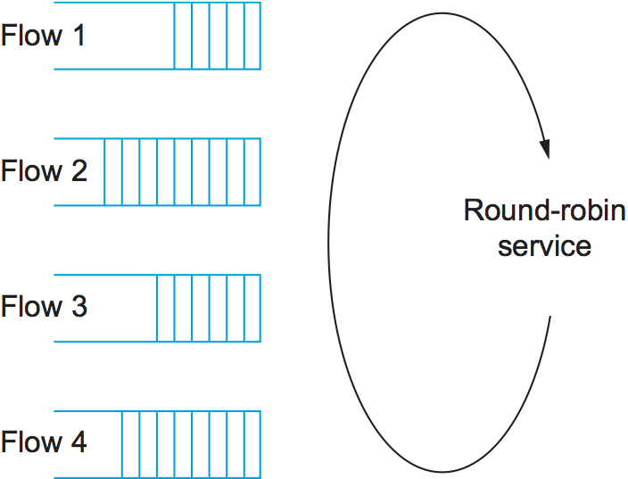

# {{Paj.Toe}}

不管资源分配机制的其余部分是多么简单或多么复杂,每个路由器都必须实现一些排队规则,该规则管理如何在等待传输时缓冲数据包. 排队算法可以被认为是分配带宽 (哪些数据包被传输) 和缓冲空间 (哪些数据包被丢弃) . 它还通过确定分组等待发送的时间来直接影响分组所经历的延迟. 本节介绍了两种常见的排队算法: 先入先出 (FIFO) 和公平排队 (FQ) -并识别出已经提出的几种变化. 

## 先进先出

FIFO排队的想法,也称为先到先服务 (FCFS) 排队,很简单: 到达路由器的第一个包是要传输的第一个包. 这说明了[图1 (a) ](#fifo)它显示了一个带有"槽"的FIFO,最多可以容纳八个数据包. 假定每个路由器上的缓冲空间数量是有限的,如果数据包到达并且队列 (缓冲空间) 已满,则路由器丢弃该数据包,如下所示[图1 (b) ](#fifo). 这不考虑数据包属于哪一个流或数据包是多么重要. 这有时叫做*尾落*,因为到达FIFO尾端的数据包被丢弃. 

<figure class="line">
	
	
	<figcaption>(a) FIFO queuing; (b) tail drop at a FIFO queue.</figcaption>
</figure>
 
Note that tail drop and FIFO are two separable ideas. FIFO is a
*scheduling discipline*—it determines the order in which packets are
transmitted. Tail drop is a *drop policy*—it determines which packets
get dropped. Because FIFO and tail drop are the simplest instances of
scheduling discipline and drop policy, respectively, they are sometimes
viewed as a bundle—the vanilla queuing implementation. Unfortunately,
the bundle is often referred to simply as *FIFO queuing*, when it should
more precisely be called *FIFO with tail drop*. A later section provides
an example of another drop policy, which uses a more complex algorithm
than "Is there a free buffer?" to decide when to drop packets. Such a
drop policy may be used with FIFO, or with more complex scheduling
disciplines.

具有尾部下降的FIFO,作为所有排队算法中最简单的一种,是在编写时互联网路由器中最广泛使用的算法. 这种简单的排队方法将拥塞控制和资源分配的所有责任推到网络的边缘. 因此,目前互联网上流行的拥塞控制形式没有路由器的帮助: TCP负责检测和响应拥塞. 我们将在下一节中了解这是如何工作的. 

基本FIFO排队的一个简单变化是优先级排队. 其思想是用优先级标记每个分组;标记可以携带在IP报头中,如我们将在后面的部分中讨论的. 路由器然后实现多个FIFO队列,每个优先级类一个. 在转移到下一个优先级队列之前,如果该队列不是空的,则路由器总是从最高优先级队列发送分组. 在每个优先级中,分组仍然以FIFO方式管理. 这个想法与尽力而为的交付模型相差很小,但是它不能保证任何特定的优先级. 它只允许高优先级的数据包被切断到前线. 

当然,优先级队列的问题在于,高优先级队列可能耗尽所有其他队列;也就是说,只要高优先级队列中至少有一个高优先级分组,就不能服务低优先级队列. 为此,需要对队列中插入多少高优先级业务进行严格限制. 应该立即清楚的是,我们不能允许用户以不受控制的方式将自己的包设置为高优先级;我们必须防止他们完全这样做,或者向用户提供某种形式的"回推". 这样做的一个显而易见的方法是使用经济学ℴℴ网络在传送高优先级分组时可能比低优先级分组收取更多的费用. 然而,在诸如互联网这样的分散环境中实施这样的方案存在重大挑战. 

在Internet中使用优先级队列的一种情况是保护最重要的分组,通常是在拓扑改变之后稳定路由表所必需的路由更新. 通常,对于这样的数据包有一个特殊的队列,可以通过IP报头中的区分服务代码点 (以前是TOS字段) 来标识. 这实际上是一个简单的"区分服务"的例子. 

## 公平排队

FIFO队列的主要问题是,它不区分不同的业务源,或者,在上一节介绍的语言中,它不根据分组所属的流来分离分组. 这是两个不同层次的问题. 在某种程度上,不清楚完全在源头实现的任何拥塞控制算法是否能够充分地控制拥塞,而路由器的帮助如此之少. 我们将暂停这一点的判断,直到下一节讨论TCP拥塞控制. 在另一个级别上,因为整个拥塞控制机制在源处实现,并且FIFO队列不提供用于监视源遵守该机制的程度的手段,所以行为不当的源 (流) 可能捕获网络的任意大部分. 容量. 再次考虑因特网,给定应用程序当然有可能不使用TCP,从而绕过其端到端拥塞控制机制.  (像互联网电话这样的应用今天做到了这一点. ) 这样的应用能够用它自己的数据包淹没互联网的路由器,从而导致其他应用的数据包被丢弃. 

公平排队 (FQ) 是一种已经提出的算法来解决这个问题. FQ的思想是为路由器当前处理的每个流保持一个单独的队列. 然后,路由器以一种循环方式服务这些队列,如图所示. [图2](#fq). 当流太快发送包时,它的队列就填满了. 当队列达到特定长度时,丢弃属于该流队列的附加分组. 以这种方式,给定的源不能以牺牲其他流为代价任意增加网络容量的份额. 

<figure class="line">
	
	
	<figcaption>Round-robin service of four flows at a router.</figcaption>
</figure>

注意,FQ不涉及路由器向业务源告知关于路由器状态的任何信息,或以任何方式限制给定源发送分组的速度. 换言之,FQ仍然被设计为与端到端拥塞控制机制结合使用. 它简单地隔离交通,使得不良行为的交通来源不干扰那些忠实地实现端到端算法的人. FQ还强制执行由良好的拥塞控制算法管理的流集合之间的公平性. 

简单的,基本的想法是,仍然有少量的细节,你必须得到正确的. 主要的复杂性是在路由器上处理的数据包不一定是相同的长度. 为了真正公平地分配输出链路的带宽,需要考虑分组长度. 例如,如果路由器管理两个流,一个是1000字节的包,另一个是500字节的包 (可能是因为这个路由器上游的碎片) ,那么对每个流队列的简单的循环服务将给链路的带宽带来第一流的三分之二. DTH和第二个流仅占其带宽的三分之一. 

我们真正想要的是一点一点的循环,路由器从流1发送一个比特,然后从流2发送一个比特,等等. 显然,从不同的数据包中插入比特是不可行的. 因此,FQ机制通过首先确定给定分组将在何时使用逐比特循环发送,然后使用该结束时间来对分组进行传输来模拟该行为. 

为了理解逐比特循环的近似算法,考虑单个流的行为,并想象每次从所有活动流发送一比特的时钟滴答一次.  (流在队列中有数据时是活动的. ) 对于这个流,让$P_i$$表示分组$i$$的长度,让$S_i$$表示路由器开始发送分组$i$$的时间,让$F_i$$表示路由器完成发送分组$i$$.如果$$P_i$$是以发送分组$$i$$需要多少时钟节拍来表示的 (记住每次该流获得1位服务值时时间提前1节拍) ,那么很容易看到$$F_i=S_i+P_i$$. 

我们什么时候开始发送包$$i?这个问题的答案取决于数据包$i$是在路由器完成从该流发送数据包$i-1$之前还是之后到达的. 如果它是以前,那么逻辑上的第一个比特的包$$$ $立即传输后的最后一个比特的包$$ i*$$表示包$$$$到达路由器的时间,然后$s$i= \\max (f) *{I-1 },AAI) $$. 因此,我们可以计算

$F*i=max (f) *{I-1 },AAI) +PiI $ $

现在我们转到一个流不止一个的情况,我们发现有一个陷阱来确定$AYI $ $. 当包裹到达时,我们不能只看墙上的时钟. 如上所述,我们希望在所有活动流在逐位循环下获得1位服务时,时间都提前一个刻度,因此我们需要一个时钟,当有更多流时,该时钟前进得更慢. 具体来说,当$$$$$被传输时,时钟必须前进一滴答,如果有$$$$Active流. 这个时钟将被用来计算$AYI $ $. 

现在,对于每一个流,我们使用上面的公式计算每个到达的包$FYI $ $. 然后,我们将所有的$F_i$$作为时间戳,下一个要发送的数据包总是具有最低时间戳的数据包ℴℴ基于以上推理,该数据包应该在所有其它数据包之前完成传输. 

注意,这意味着一个分组可以到达一个流上,并且由于它比来自已经在等待发送的队列中的一些其他流的分组短,所以它可以插入到该长分组前面的队列中. 然而,这并不意味着新到达的分组可以抢占当前正在传输的分组. 正是由于这种抢占的缺乏,使得刚才描述的FQ的实现无法精确地模拟我们试图近似的逐位循环方案. 

<figure class="line">
	
	
	<figcaption>Example of fair queuing in action: (a) Packets with
	earlier finishing times are sent first; (b) sending of a packet
	already in progress is completed.</figcaption>
</figure>

为了更好地了解公平队列的实现方式,请考虑[图3](#fair-queuing). 第(a)部分显示了两个流的队列;算法从流1中选择要在流2队列中的分组之前传输的两个分组,因为它们较早的完成时间. 在 (b) 中,当来自流1的分组到达时,路由器已经开始从流2发送分组. 如果我们一直使用完美的逐位公平排队,那么到达流1的分组在流2之前就已经完成了,但是实现并不抢占流2分组. 

关于公平排队有两件事要注意. 首先,只要队列中至少有一个分组,链路就永远不会闲置. 具有这种特性的任何排队方案被称为*劳动保护*. 节省工作的一个效果是,如果我和许多不发送任何数据的流共享一个链接,那么我就可以为我的流使用完整的链接容量. 然而,一旦其他流开始发送,它们将开始使用它们的共享,并且我的流可用的容量将下降. 

需要注意的第二件事是,如果链接已完全加载,并且有$n$流发送数据,那么我不能使用超过$1/n$th的链接带宽. 如果我尝试发送更多,我的包将被分配越来越大的时间戳,导致它们坐在队列中等待传输的时间更长. 最终,队列将溢出ℴℴ尽管丢弃的是我的包还是其他人的包,这取决于我们使用公平队列的事实. 这是由丢弃策略决定的;FQ是一种调度算法,它与FIFO一样,可以与各种丢弃策略相结合. 

因为FQ是工作守恒的,任何一个流不使用的带宽都可以自动地用于其他流. 例如,如果我们有四个流通过路由器,并且它们都在发送分组,那么每个流将接收四分之一的带宽. 但是,如果其中一个空闲时间足够长,所有的数据包都从路由器的队列中排出,那么可用的带宽将在剩余的三个流之间共享,每个流现在将接收带宽的三分之一. 因此,我们可以认为FQ是为每个流提供一个保证的最小带宽份额,如果其他流不使用它们的股票,它可以获得超过其保证的可能性. 

可以实现FQ的变化,称为FQ. *加权公平队列* (WFQ) ,它允许将权重分配给每个流 (队列) . 这个权值逻辑上指定每次发送队列的路由器有多少比特,这有效地控制了链路将获得的带宽的百分比. 简单的FQ给每个队列的权重为1,这意味着逻辑上每个队列只发送1位. 这导致每个流在$ $$$流时获得$$ 1 /N $ $TH的带宽. 然而,使用WFQ,一个队列可能具有2的权重,第二个队列可能具有1的权重,而第三个队列可能具有3的权重. 假设每个队列总是包含等待传输的分组,那么第一个流将得到可用带宽的三分之一,第二个流将得到可用带宽的六分之一,第三个流将得到可用带宽的一半. 

虽然我们已经描述了WFQ在流方面,注意它可以实现在*班*在流量方面,类的定义与在本章开始时引入的简单流不同. 例如,我们可以使用IP报头中的一些位来识别类并分配队列和每个类的权重. 这正是后面一节中描述的区分服务架构的一部分. 

注意,执行WFQ的路由器必须通过手动配置或通过来自源的某种信令来学习从某个地方为每个队列分配什么权重. 在后一种情况下,我们正朝着基于预订的模式迈进. 仅向队列分配权重就提供了一种相当弱的预约形式,因为这些权重仅与流接收的带宽间接相关.  (流可用的带宽还取决于,例如,有多少其他流共享链接. ) 我们将在后面的小节中看到如何将WFQ用作基于保留的资源分配机制的组件. 

最后,我们观察到,队列管理的整个讨论说明了一个重要的系统设计原理. *分离政策与机制*. 其思想是将每个机制视为一个黑箱,提供一个可由一组旋钮控制的多方面服务. 策略指定这些旋钮的特定设置,但不知道 (或关心) 黑盒是如何实现的. 在这种情况下,所讨论的机制是排队规则,并且策略是哪个流得到什么服务级别 (例如,优先级或权重) 的特定设置. 我们将讨论一些可用于WFQ机制的策略,在后面的章节中. 
