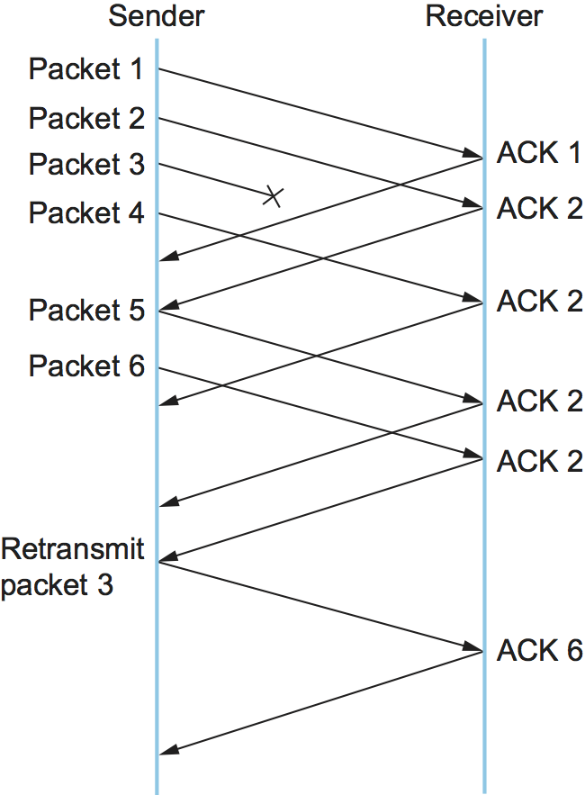

# {{Paj.Toe}}

本节描述了目前使用的端到端拥塞控制的主要例子,即TCP实现的拥塞控制. TCP的基本策略是毫无保留地向网络发送数据包,然后对发生的可观测事件作出响应. TCP仅假设在网络路由器中的FIFO排队,但也适用于公平排队. 

TCP拥塞控制在TCP/IP协议栈开始运行大约八年后,由Van Jacobson在20世纪80年代末引入互联网. 就在这个时间之前,因特网正遭受着拥塞崩溃ℴℴ主机将尽可能快地将数据包发送到因特网,某些路由器将发生拥塞 (导致数据包被丢弃) ,主机将超时并重传EIR数据包,导致更拥挤. 

广义地说,TCP拥塞控制的思想是让每个源确定网络中有多少容量可用,以便它知道在传输中可以安全地拥有多少分组. 一旦给定源有这么多包在运输中,它就使用ACK的到达作为它的一个包已经离开网络的信号,并且因此在不增加拥塞级别的情况下将新包插入网络是安全的. 通过使用ACK来加快数据包的传输速度,TCP被称为*自计时*. 当然,首先确定可用容量不是一件容易的事情. 更糟糕的是,因为其他连接来来往往,可用带宽随时间而变化,这意味着任何给定源都必须能够调整它在传输中的数据包数量. 本节介绍TCP用于解决这些和其他问题的算法. 

注意,尽管我们一次只描述一个TCP拥塞控制机制,因此给人的印象是我们在讨论三个独立的机制,但是只有当它们作为一个整体来看时,我们才具有TCP拥塞控制. 此外,我们将在这里开始使用TCP拥塞控制的变体,通常被称为*标准TCP*我们将看到现在使用的TCP拥塞控制实际上有很多变体,并且研究人员继续探索解决这个问题的新方法. 下面讨论这些新方法中的一些. 

## 加性/乘法递减

TCP为每个连接维护一个新的状态变量,称为`CongestionWindow`它被源用来限制在给定的时间内允许在传输过程中有多少数据. 拥塞窗口是拥塞控制与流量控制的广告窗口相对应的窗口. TCP被修改为允许的未分类数据的最大字节数现在是拥塞窗口和广告窗口的最小值. 因此,使用前一章定义的变量,TCP的有效窗口被修改如下: 

```pseudo
MaxWindow = MIN(CongestionWindow, AdvertisedWindow)
EffectiveWindow = MaxWindow -  (LastByteSent - LastByteAcked)
```

也就是说,`MaxWindow`替换`AdvertisedWindow`在计算中`EffectiveWindow`. 因此,TCP源不能比最慢的组件ℴℴ网络或目的地主机ℴℴ所能容纳的发送速度更快. 

当然,问题是TCP是如何学习一个合适的值的. `CongestionWindow`. 不像`AdvertisedWindow`,这是由接收端发送的连接,没有人发送合适的`CongestionWindow`到TCP的发送端. 答案是TCP源设置`CongestionWindow`基于拥塞水平,它感知到存在于网络中. 这包括当拥塞水平上升时减少拥塞窗口,当拥塞水平下降时增加拥塞窗口. 总而言之,这种机制通常称为*加性/乘法递减* (AIMD) ;下面这个名字的原因将变得明显. 

那么,关键问题是,源如何确定网络拥塞,以及它应该如何减少拥塞窗口?答案是基于这样的观察,即分组未被传送的主要原因,以及超时结果,即分组由于拥塞而被丢弃. 由于传输过程中的错误,丢包是很少见的. 因此,TCP将超时解释为拥塞的标志,并降低其传输速率. 具体地说,每次超时发生时,源集合`CongestionWindow`其先前价值的一半. 这一半的`CongestionWindow`对于每一个超时对应于"乘法减少"的一部分AIMD. 

虽然`CongestionWindow`以字节的形式定义,如果我们认为整个分组是最容易理解乘法下降. 例如,假设`CongestionWindow`当前设置为16个数据包. 如果检测到丢失,`CongestionWindow`设置为8.  (通常,当超时发生时检测到丢失,但是正如我们在下面看到的,TCP具有另一种机制来检测丢失的分组. ) `CongestionWindow`减少到4个,然后2个,最后到1个包. `CongestionWindow`不允许低于单个数据包的大小,或者在TCP术语中,*最大段尺寸*.

<figure class="line">
	<a id="linear"></a>
	
	<figcaption>Packets in transit during additive increase, with one 
	packet being added each RTT.</figcaption>
</figure>

仅减小窗口大小的拥塞控制策略显然过于保守. 我们还需要能够增加拥塞窗口以利用网络中的新可用容量. 这是AIMD的"加性增加"部分,它的工作原理如下. 每次源成功发送一个`CongestionWindow`数据包的价值-也就是说,在上次往返时间 (RTT) 期间发送的每个数据包都是ACKed-它添加相当于1个数据包`CongestionWindow`. 这种线性增长在[图1](#linear). 注意,在实践中,TCP并不等待整个窗口的ACK值向拥塞窗口中添加1个数据包值,而是递增. `CongestionWindow`对每一个到达的ACK稍加一点. 具体而言,每次ACK到达时,拥塞窗口递增如下: 

```pseudo
Increment = MSS x (MSS/CongestionWindow)
CongestionWindow += Increment
```

也就是说,而不是递增. `CongestionWindow`整个`MSS`每个RTT字节,我们用一小部分增加它. `MSS`每次接收到ACK. 假设每个ACK确认收到`MSS`字节,然后是分数. 

<figure class="line">
	<a id="sawtooth"></a>
	
	<figcaption>Typical TCP sawtooth pattern.</figcaption>
</figure>
 
This pattern of continually increasing and decreasing the congestion
window continues throughout the lifetime of the connection. In fact, if
you plot the current value of `CongestionWindow` as a function of
time, you get a sawtooth pattern, as illustrated in
[Figure 2](#sawtooth). The important concept to understand about AIMD
is that the source is willing to reduce its congestion window at a much
faster rate than it is willing to increase its congestion window. This
is in contrast to an additive increase/additive decrease strategy in
which the window would be increased by 1 packet when an ACK arrives and
decreased by 1 when a timeout occurs. It has been shown that AIMD is a
necessary condition for a congestion-control mechanism to be stable (see
the Further Reading section). One intuitive reason to decrease the
window aggressively and increase it conservatively is that the
consequences of having too large a window are much worse than those of
it being too small. For example, when the window is too large, packets
that are dropped will be retransmitted, making congestion even worse;
thus, it is important to get out of this state quickly.

最后,因为超时是触发乘法减少的拥塞的指示,所以TCP需要它能够负担的最精确的超时机制. 我们已经在前面的章节中介绍了TCP超时机制,所以我们不重复这里. 关于该机制,需要记住的两件事是: (1)超时被设置为平均RTT和该平均值中的标准偏差的函数,并且(2)由于用精确的时钟测量每个传输的成本,TCP仅对每个RTT的往返时间采样一次(ra). 使用一个粗粒度 (500毫秒) 时钟每包一次. 

## 慢启动

刚刚描述的附加增加机制是当源工作接近网络的可用容量时使用的正确方法,但是当连接从零开始时需要太长时间来增加连接. TCP因此提供了第二种机制,具有讽刺意味的*慢启动*,用于从冷启动快速增加拥塞窗口. 慢启动有效地增加拥塞窗口指数,而不是线性. 

具体来说,源是通过设置开始的. `CongestionWindow`一包. 当这个数据包的ACK到达时,TCP增加1`CongestionWindow`然后发送两个数据包. 在接收到相应的两个ACK时,TCP增量`CongestionWindow`对于每个ACK由2-One和下一个发送四个分组. 最终的结果是TCP有效地翻倍了它在每个RTT中传输的数据包的数量. [图3](#exponential)显示了在慢启动过程中的数据包数量的增长. 比较这与线性增长的添加剂增长[图1](#linear).

<figure class="line">
	<a id="exponential"></a>
	
	<figcaption>Packets in transit during slow start.</figcaption>
</figure>

为什么任何指数机制会被称为"缓慢"起初是令人困惑的,但如果放在适当的历史语境中,它可以被解释. 我们需要将慢启动与前面小节的线性机制进行比较,而不是与TCP的原始行为进行比较. 考虑一下当建立连接并且源首先开始发送数据包 (即,当前传输中没有数据包时) 会发生什么. 如果源发送的广告窗口允许的尽可能多的分组ℴℴ这正是TCP在开发慢启动之前所做的ℴℴ那么即使网络中有相当大的可用带宽,路由器也可能不能消耗该分组突发. 这取决于路由器上有多少缓冲空间. 因此,慢启动被设计成将数据包隔离开,从而不会发生这种突发. 换言之,即使其指数增长快于线性增长,慢启动也比同时发送整个广告窗口的数据要慢得多. 

实际上有两种不同的情况,即慢速启动. 第一个是在一个连接的开始,在那个时候,源不知道在给定的时间内,它将能够在传输中有多少个数据包.  (记住TCP在9600个BPS链路到2.4-GbPS链路上运行,所以没有办法知道网络的容量. ) 在这种情况下,慢速启动继续进行. `CongestionWindow`每个RTT直到有一个丢失,此时超时导致乘法减少除法. `CongestionWindow`到2点. 

使用慢启动的第二种情况比较微妙;它发生在连接死机而等待超时发生的时候. 回想一下TCP的滑动窗口算法是如何工作的ℴℴ当一个包丢失时,源最终到达它已经发送了广告窗口所允许的数据的点,因此它在等待不会到达的ACK时阻塞. 最终,会出现超时,但是此时传输中没有数据包,这意味着源将不会接收任何ACK来对新数据包的传输"计时". 相反,源将接收单个累计ACK,该ACK重新打开整个广告窗口,但是,如上所述,源然后使用慢启动来重新启动数据流,而不是一次将整个窗口的数据全部转储到网络上. 

虽然源再次使用慢启动,但它现在知道的信息比连接开始时要多. 具体地说,源具有当前的 (有用的) 值. `CongestionWindow`这就是价值`CongestionWindow`在最后一个分组丢失之前存在的,作为丢失的结果除以2. 我们可以认为这是*目标*拥塞窗口. 慢启动用于快速地将发送速率提高到这个值,然后使用加法增加超过这一点. 注意,我们有一个小的簿记问题要处理,因为我们希望记住乘法减少导致的目标拥塞窗口以及*实际的*拥塞窗口使用慢启动. 为了解决这个问题,TCP引入了一个临时变量来存储目标窗口,通常称为`CongestionThreshold`,等于`CongestionWindow`由乘法递减引起的价值. 变量`CongestionWindow`然后重置为一个数据包,每个接收到的ACK通过一个数据包递增,直到到达为止. `CongestionThreshold`在每一RTT增加一个数据包. 

换言之,TCP增加了由下面的代码片段定义的拥塞窗口: 

```c
{
    u_int    cw = state->CongestionWindow;
    u_int    incr = state->maxseg;

    if (cw > state->CongestionThreshold)
        incr = incr * incr / cw;
    state->CongestionWindow = MIN(cw + incr, TCP_MAXWIN);
}
```

哪里`state`表示特定TCP连接的状态,并定义允许拥塞窗口增长的上限. 

[图4](#trace1)跟踪TCP的方式`CongestionWindow`随着时间的推移,增加和下降-来说明慢启动和添加剂增加/乘法减少的相互作用. 这个跟踪是从一个实际的TCP连接中获取的,并显示当前值`CongestionWindow`-随着时间的推移彩色线. 

<figure class="line">
	<a id="trace1"></a>
	
	<figcaption>Behavior of TCP congestion control. Colored line = value
	of `CongestionWindow` over time; solid bullets at top of graph
	= timeouts; hash marks at top of graph = time when each packet is
	transmitted; vertical bars = time when a packet that was
	eventually retransmitted was first transmitted.</figcaption>
</figure>

关于这个痕迹有几点需要注意. 首先是连接开始时拥塞窗口的快速增加. 这对应于初始慢启动阶段. 慢速启动阶段继续进行,直到大约0.4秒的几个数据包丢失到连接中,此时`CongestionWindow`在约34 kb处变平.  (为什么在慢启动期间丢失这么多数据包将被讨论. ) 拥塞窗口变平的原因是没有几个ACK到达,这是由于几个数据包丢失的事实. 事实上,在此期间没有发送新的数据包,如图的顶部缺少散列标记所表示的那样. 超时最终发生在大约2秒,此时拥塞窗口被划分为2 (即,从约34 kb减少到约17 kb) . `CongestionThreshold`设置为此值. 慢速启动`CongestionWindow`重置为一个包,并开始从那里开始爬升. 

跟踪中没有足够的细节来确切地看到当仅仅在2秒之后丢失两个分组时发生了什么,因此我们跳到在2到4秒之间发生的拥塞窗口的线性增加. 这对应于添加剂的增加. 大约4秒,`CongestionWindow`由于丢失的数据包再次变平. 现在,大约5.5秒: 

1.  超时发生,导致拥塞窗口被划分为2,从约22 kb下降到11 kb;`CongestionThreshold`设置为这个数量. 

2.  `CongestionWindow`当发送器进入慢启动时,重置为一个数据包. 

3.  慢启动原因`CongestionWindow`指数增长直至达到`CongestionThreshold`.

4.  `CongestionWindow`然后线性增长. 

当另一个超时发生时,同样的模式在大约8秒的时间内重复. 

我们现在回到了为什么在最初的慢启动期间丢失这么多数据包的问题. 在这一点上,TCP试图了解网络上有多少带宽可用. 这是一项非常艰巨的任务. 如果在这个阶段源不积极-例如,如果它只是线性地增加拥塞窗口-那么它需要很长时间来发现有多少带宽可用. 这会对该连接实现的吞吐量产生显著影响. 另一方面,如果在此阶段源是攻击性的,因为TCP处于指数增长期间,那么源将冒着让网络丢弃半个窗口值的分组的风险. 

要查看在指数增长期间会发生什么,请考虑源刚刚能够通过网络成功地发送16个分组,导致其拥塞窗口加倍到32的情况. 然而,假设网络恰好有足够的容量来支持来自这个源的16个包. 可能的结果是在新的拥塞窗口下发送的32个分组中有16个会被网络丢弃;实际上,这是最坏的结果,因为一些分组将在一些路由器中进行缓冲. 随着网络的$$延迟时间乘以$$产品的增加,这个问题将变得越来越严重. 例如,500KB的$ .乘以带宽$乘积意味着每个连接在每个连接开始时都有可能丢失多达500KB的数据. 当然,这假设源和目的地都实现了"大窗口"扩展. 

一些协议设计者已经提出了慢启动的替代方案,从而源试图通过更复杂的方法估计可用带宽. 最近的例子是*快速启动*在IETF中进行标准化的机制. 基本思想是,TCP发送者可以通过将请求的速率作为IP选项放入其SYN分组中来请求大于慢启动允许的初始发送速率. 沿着路径的路由器可以检查该选项,评估该流的输出链路上的当前拥塞级别,并决定该速率是否可接受,较低速率是否可接受,或者是否应该使用标准慢启动. 当SYN到达接收器时,它将包含路径上所有路由器可接受的速率或路径上一个或多个路由器不支持快速启动请求的指示. 在前一种情况下,TCP发送方使用该速率开始传输;在后一种情况下,它返回到标准的慢启动. 如果允许TCP以更高的速率开始发送,则会话可能更快地到达填充管道的点,而不是花费许多往返时间来完成. 

显然,这种对TCP增强的挑战之一是,它比标准TCP需要来自路由器的大量合作. 如果路径中的单个路由器不支持快速启动,则系统恢复到标准慢速启动. 因此,这些类型的增强可能需要很长时间才能进入互联网;目前,它们更可能用于受控的网络环境 (例如,研究网络) . 

## 快速重传和快速恢复

到目前为止所描述的机制是向TCP增加拥塞控制的最初提议的一部分. 然而,很快发现,TCP超时的粗粒度实现导致很长一段时间,在此期间连接在等待计时器到期时死机. 正因为如此,一种新的机制叫做*快重传*添加到TCP中. 快速重传是一种启发式,有时比常规超时机制更快地触发丢弃分组的重传. 快速重传机制不替换常规超时,它只是增强了这种功能. 

快速重传的想法很简单. 每当一个数据包到达接收端,接收方都会作出应答,即使这个序列号已经被确认. 因此,当一个数据包到达时没有顺序-当TCP还不能确认数据包包含的数据,因为较早的数据还没有到达-TCP重新发送它上次发送的同样的确认. 相同确认的第二次传输称为*重复确认*. 当发送方看到一个重复的ACK时,它知道对方一定收到了一个无序的分组,这表明一个较早的分组可能已经丢失. 由于先前的分组也可能只是被延迟而不是丢失,所以发送方等待直到看到一些重复的ACK,然后重新发送丢失的分组. 在实践中,TCP等待直到它在重发分组之前已经看到三个重复的ACK. 

<figure class="line">
	<a id="tcp-fast"></a>
	
	<figcaption>Fast retransmit based on duplicate ACKs.</figcaption>
</figure>

[图5](#tcp-fast)说明重复的ACK是如何导致快速重传的. 在这个例子中,目的地接收分组1和2,但是分组3在网络中丢失. 因此,当分组4到达时,目的地将为分组2发送重复ACK,当分组5到达时,再次发送ACK.  (为了简化这个示例,我们考虑分组1ㄡ2ㄡ3等,而不是担心每个字节的序列号. ) 当发送方看到分组2的第三个重复ACKℴℴ因为接收方已经得到分组6而发送的ACKℴℴ时,它重新发送分组3. 注意,当重传的分组3的副本到达目的地时,接收器然后向源发送直到数据包6并且包括数据包6的所有内容的累积ACK. 

<figure class="line">
	<a id="trace2"></a>
	
	<figcaption>Trace of TCP with fast retransmit. Colored line
	=`CongestionWindow`; solid bullet = timeout; hash marks = time
	when each packet is transmitted; vertical bars = time when a
	packet that was eventually retransmitted was first
	transmitted.</figcaption>
</figure>

[图6](#trace2)用快速重传机制说明TCP版本的行为. 有趣的是,将这个跟踪与给定的[图4](#trace1)在没有实现快速重传的情况下,消除了拥塞窗口保持平坦且没有发送分组的长周期. 一般来说,这种技术能够消除典型TCP连接上的大约一半的粗粒度超时,导致吞吐量比原本可能实现的提高大约20%. 注意,快速重发策略并不能消除所有粗粒度超时. 这是因为对于较小的窗口大小,传输中的数据包将不足以导致传递足够的重复ACK. 给定足够的丢失数据包ℴℴ例如,在初始慢启动阶段发生的情况ℴℴ滑动窗口算法最终阻塞发送方直到超时发生. 给定当前64-KB的最大广告窗口大小,TCP的快速重传机制在实践中能够检测每个窗口最多三个丢弃的分组. 

最后,我们可以做最后的改进. 当快速重传机制发出拥塞信号时,而不是将拥塞窗口一直丢回到一个分组并慢速启动时,可以使用仍在管道中的ACK来对分组的发送进行时钟控制. 这个机制,叫做*快速恢复*有效去除在快速重传检测到丢失分组和附加增加开始之间发生的慢启动阶段. 例如,快速恢复避免了在3.8和4秒之间的慢启动周期. [图6](#trace2)取而代之的是只将拥塞窗口削减一半 (从22 kb到11 kb) ,并恢复加性增加. 换句话说,慢速启动只在连接开始时使用,并且每当发生粗粒度超时时. 在所有其他时间,拥塞窗口遵循纯加性增加/乘法减少模式. 
